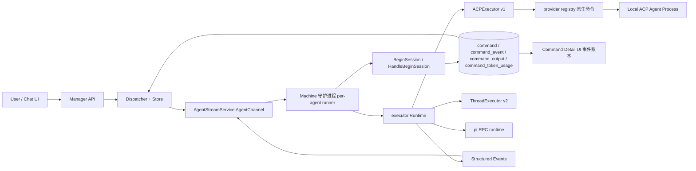
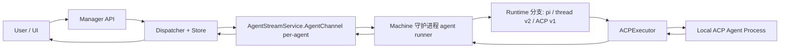

# Laelia Agent 基于 ACP 调用 LLM Agent 的详细设计方案

> 状态：2026-09-06 已对照当前代码核对更新。主要变化：本方案已落地——结构化事件/WatchCommandEvents/command_event 表等按设计实现，但执行模型已演进为消息驱动的 drain 会话（无 SendCommand），agent 守护进程重构为 machine 守护进程（每 agent 一条 AgentChannel），shell 执行器被整体移除，并新增 acp-v2（codex）与 pi 运行时。

## 设计目标

本文档描述如何在保留现有 Laelia manager ↔ agent 控制链路的前提下，引入 [Agent Client Protocol (ACP)](https://agentclientprotocol.com/) 和 `acp-go-sdk`，使 Laelia agent 能够在目标主机上调用本机 LLM agent 执行任务，并将执行过程、工具调用、diff、最终结果等信息稳定回报到 manager。

本方案关注以下目标：

1. **可靠**：任务执行、流式过程、最终结果、取消、断线重连、事件回放都可控。
2. **安全**：manager 不直接控制高风险底层运行参数，ACP 子进程在受限环境中运行，过程数据可审计。
3. **高效**：尽量复用现有 command/dispatcher/store/UI 骨架，避免推倒重来。
4. **优雅**：shell command 与 ACP task 在同一套资源模型下共存，兼容旧 agent，支持灰度上线。

---

## 一、背景与现状分析

### 1.1 当前执行链路（已随实现更新）

当前 Laelia 的远程执行链路如下：

1. 用户/agent 在会话（channel/DM）中发消息（`SendMessage`/`PostMessage`），或 reminder 到期；这些进展都会累积到 agent 的 durable per-channel cursor 之后的 `room_version` 上。
2. agent 客户端经 [backend/agent/client/command_stream.go](/home/ran/gocode/laelia/backend/agent/client/command_stream.go) 持有 `AgentStreamService.AgentChannel` 双向流，发 `BeginSession` 询问是否有工作；manager 在 [backend/manager/component/dispatcher/dispatcher.go](/home/ran/gocode/laelia/backend/manager/component/dispatcher/dispatcher.go) 的 `HandleBeginSession` 中检查会话游标与到期 reminder，有工作则创建一条 RUNNING 的 `command` 记录并返回 `command_id`（无 `SendCommand` RPC——命令由会话消息驱动创建）。
3. agent 客户端按该 command_id 启动 executor 运行时并执行本轮任务：ACP v1（`backend/agent/executor/acp_executor.go`，opencode/claude-code）、ACP v2 线程协议（`backend/agent/executor/thread_executor.go` + `backend/agent/acp2/`，codex）或 pi RPC 运行时（`backend/agent/pi/`）。
4. agent 把文本分片作为 `CommandProgress`、结构化过程作为 `CommandEvent`、最终结果作为 `CommandResult` 回传。
5. manager 将文本写入 `command_output`、事件写入 `command_event`，前端详情页通过 `WatchCommand` / `WatchCommandEvents`（均支持 `after_seq_no`）订阅。

> 历史注：本方案撰写时的 shell（`BashExecutor`）链路已整体移除——`command` 资源保留，但所有执行器都是 LLM agent 运行时，"shell 与 ACP 双模共存"的过渡态不复存在。

### 1.2 现状优点

1. 任务调度链路已经完整，支持会话收口、运行中状态、取消（`CancelCommand`）、中途注入（`SteerCommand`）、输出/事件回放、结果收口。
2. manager/machine 已经有成熟的连接、鉴权、心跳、断开和恢复骨架（machine 级 `MachineChannel` 控制面 + 每 agent 一条 `AgentChannel` 数据面）。
3. 前端已有列表页、详情页、事件账本组件，无需另起一套任务系统。

### 1.3 现状不足（历史评估，落地结果见括号内）

1. **执行器强绑定 shell**（已解决：shell 执行器移除，统一 `executor.Runtime` 接口，见 `backend/agent/executor/runtime.go`）。
2. **输出模型过于扁平**（已解决：`STDOUT/STDERR/SYSTEM/ASSISTANT` 四类文本输出 + `CommandEvent` 结构化事件流）。
3. **manager 侧缺少 ACP 专属权限与策略控制**（部分落地：provider/model 由 server 在 `UpdateAgentACPConfig`/`CreateAgent` 校验（`backend/manager/api/v1/agent_config.go` 的 `validateAgentACPConfig`），raw event 有独立权限 `laelia.conversations.reviewAll`；完整的审批/策略面未建设）。
4. **恢复语义仅覆盖简单命令输出**（部分落地：`AgentReady` 携带 `last_command_id/last_ack_seq/last_event_seq`，agent 本地 `command-state.json` 持久化已上报位点；断连时仍在跑的命令被标 FAILED 不续播，会话级恢复以 agent 的 channel cursor 为真相源）。
5. **高风险参数边界未定义**（已解决：manager 不可传二进制路径/工具白名单/敏感 env；ACP 配置由 manager 侧 `AgentACPConfig` 模板集中管理，启动命令由 agent 侧 provider registry 派生）。

### 1.4 ACP 集成边界

本方案明确采用以下边界：

1. 仅支持本机 ACP agent 子进程 + stdio（未引入远程 transport）。
2. Laelia agent 作为 ACP Client，不作为 ACP Agent。
3. manager 继续通过现有 Laelia 协议与 agent 通信，不直接与 ACP 对接。
4. 每个 Laelia agent 同一时刻单会话串行执行（drain 循环逐会话推进），不引入多会话并发调度。
5. 高风险运行参数由 manager 侧 server-owned `AgentACPConfig` 模板集中管理（原设计的"agent 本地 profile YAML"未采用，见 §5.7），启动命令由 agent 侧 provider registry 派生。

---

## 二、设计原则

### 2.1 保留现有 command 资源，扩展为通用 execution 容器

首版不重命名 `command` 资源，也不重构整个 manager UI 和数据模型。`command` 继续作为统一任务实例。

原设计的 `executor_kind` 区分字段在落地后被**移除**（proto 中已 `reserved`，见 [proto/v1/v1/command.proto](/home/ran/gocode/laelia/proto/v1/v1/command.proto) 的 `Command` 消息）：shell 执行器不复存在，所有执行器都是 LLM agent 运行时，执行类型改由 `LifecyclePayload.executor_kind` 在事件载荷中表达。这样做的理由：

1. 当前列表、详情、watch、存储、调度都围绕 `command` 建立，复用成本最低。
2. 数据库迁移最小（`instruction/profile/allow_diff/result_json/final_summary` 等列直接落在 `command` 表上）。
3. 后续如果需要统一对外文案为 task/run/execution，可以在不破坏存量实现的基础上渐进演进。

### 2.2 过程真相源应当是结构化事件，而不是纯文本输出

ACP 的核心价值不只是“返回一段文本”，而是“能稳定表达执行过程”。

已落地为独立的结构化事件流（`CommandEvent` + `WatchCommandEvents`），覆盖：

1. 生命周期事件（`LIFECYCLE`）
2. 文本增量（`TEXT_DELTA`）
3. 工具调用开始/结束（`TOOL_CALL_STARTED/FINISHED`）
4. diff 产出（`DIFF_EMITTED`）
5. warning（`WARNING`）
6. raw ACP event 归档（`RAW_ACP`，批量聚合写入）
7. 最终摘要（`FINAL_SUMMARY`）
8. 上下文/用量观测（`CONTEXT_COMPACTION_*`、`CONTEXT_USAGE_UPDATE`、`TOKEN_USAGE`，落地时新增）

现有 `command_output` 保留，作为终端文本投影视图（含落地时新增的 `ASSISTANT` 输出类型）。

### 2.3 manager 控制权限，agent 控制能力边界

manager 负责：

1. 谁可以发起任务（IAM + 会话策略）
2. agent 是否具备执行能力（`AgentCapability.supports_acp / supports_pi` 门禁，见 dispatcher 的 `HandleBeginSession`）
3. ACP 配置的合法性与 provider/model 可用性（`validateAgentACPConfig`）
4. 谁可以查看结构化事件/raw event（`laelia.conversations.reviewAll`）

agent 负责：

1. 允许使用哪个 ACP agent 二进制（provider registry，machine 守护进程侧）
2. 启动命令与进程环境（`buildRuntimeEnv` 的 allow_env/custom_env/`LAELIA_*` 引导变量）
3. 输出与事件上限（`executor.Limits` 模板默认值）
4. 本地会话状态与会话恢复（`command-state.json` / `acp-session.json`）

这两层边界不能混淆。

---

## 三、总体架构

### 3.1 目标架构（已按实现更新）



### 3.2 关键抽象

1. **Command**：统一任务实例（会话驱动的 drain 会话锚点）。
2. **Runtime**：agent 内统一执行器接口（`backend/agent/executor/runtime.go`；实现：`ACPExecutor` / `ThreadExecutor` / `pi.Pi`）。
3. **CommandEvent**：结构化过程事件（`proto/v1/v1/command.proto` 的 `CommandEventType` + oneof 载荷）。
4. **Text Projection**：从运行时输出投影为文本终端输出（`CommandOutput` STDOUT/STDERR/SYSTEM/ASSISTANT；`drain_runner.go` 的 `mergedText` 负责合并）。
5. **AgentACPConfig**：manager 侧 server-owned 能力配置（模板 + provider registry 派生启动命令）。

---

## 四、协议与数据模型设计

### 4.1 `command.proto` 落地状态

[proto/v1/v1/command.proto](/home/ran/gocode/laelia/proto/v1/v1/command.proto) 已按设计扩展并落地，与原设计的差异如下。

#### 4.1.1 执行类型（原设计字段，已移除）

原设计的 `ExecutorKind` enum 未落地——`Command.executor_kind` 已 `reserved`（连同 `source`）。执行类型改由 `LifecyclePayload.executor_kind` 表达（drain 会话统一写 `"ACP"`）。

#### 4.1.2 任务请求（已落地）

`Command` 资源与 `CommandRequest`（agent ↔ manager 流内消息）实际携带：

1. `instruction`（Command 字段 16；CommandRequest 字段 2）— 本设计的 `instruction/task_payload` 已落地为 `instruction`
2. `profile`（Command 字段 17；CommandRequest 字段 3）— 原设计 `profile` 已落地
3. `allow_diff`（Command 字段 20；CommandRequest 字段 7）
4. `env` / `working_dir` / `timeout_seconds`（CommandRequest 字段 4/5/6）
5. `principal_id` / `conversation_id` / `reply_to_message_id` / `agent_display_name`（CommandRequest 字段 8-11，会话关联与提示词注入用）

命令不再由 `SendCommand` 下发：`CommandService` 现仅有 `ListCommands / GetCommand / CancelCommand / SteerCommand / WatchCommand / WatchCommandEvents / GetCommandContext` 等读取/控制 RPC；命令创建发生在 dispatcher 的 `HandleBeginSession`（见 §6.1）。`metadata` 与 manager 可传底层子进程参数的设计未被采纳（`env` 仅保留且生产路径为空）。

#### 4.1.3 结果与统计（已落地）

`Command` 实际字段：`final_summary`（18）、`result`（19，`google.protobuf.Struct`，DB 列 `result_json`）、`exit_code/duration_ms/status` 等；`usage_stats/artifact_refs` 未落地，token 用量改为独立结构化事件 `TOKEN_USAGE` 并落 `command_token_usage` 表。

### 4.2 `CommandEvent`（已落地）

以独立消息 + watch 接口实现（不复用 `CommandOutput.SYSTEM`）：

```protobuf
message CommandEvent {
  string command_id = 1;
  int32 seq_no = 2;
  CommandEventType type = 3;
  string summary = 4;
  google.protobuf.Timestamp timestamp = 6;
  oneof payload { ... }  // 生命周期/文本/工具/diff/warning/raw/摘要/上下文/用量
}
```

与原设计的差异：`payload_json` 字段改为 **oneof 强类型载荷**（DB 仍存 `payload_json` JSONB 列，由 `marshalEventPayload` 从 oneof 序列化而来）。

实际事件类型（`CommandEventType`）：`LIFECYCLE / TEXT_DELTA / TOOL_CALL_STARTED / TOOL_CALL_FINISHED / DIFF_EMITTED / WARNING / RAW_ACP / FINAL_SUMMARY`（1-8 与设计一致），落地时新增 `CONTEXT_COMPACTION_STARTED/FINISHED / CONTEXT_USAGE_UPDATE / TOKEN_USAGE`（12-15）；原设计的权限事件（`PERMISSION_REQUESTED` 等，9-11）已实现后被移除（权限改为运行时自动授予）。

已落地接口：

1. `WatchCommandEvents`（支持 `after_seq_no`）✓
2. `GetCommandContext`（一次性返回 command + outputs + events）✓；`ListCommandEvents` 未单独建 RPC

### 4.3 `agent.proto` 能力面（已落地为 `AgentCapability`）

[proto/v1/v1/agent.proto](/home/ran/gocode/laelia/proto/v1/v1/agent.proto) 的 `AgentCapability` 实际字段：`supports_acp`、`max_timeout_seconds`、`supports_diff`、`supports_raw_events`、`supports_tool_traces`、`max_event_count`、`max_output_bytes`、`supports_autonomous_decision`、`supports_pi`（非 ACP pi 运行时的门禁位）。

原设计的 `default_profile / available_profiles` 未落地：profile 概念被 server-owned `AgentACPConfig`（manager 集中下发）+ agent 侧 provider registry（派生启动命令）取代。能力由 `BuildCapability`（`backend/agent/executor/acp_config.go`）从配置推导并在连接时上报。

### 4.4 存储模型（已落地）

#### 4.4.1 `command` 表

[backend/manager/migration/migration/LATEST.sql](/home/ran/gocode/laelia/backend/manager/migration/migration/LATEST.sql) 的 `command` 表实际新增/扩展列：`instruction`、`profile`、`allow_diff`、`timeout_seconds`、`final_summary`、`last_ack_seq`、`machine_id`（machine 重构后冗余）、`conversation_id`；最终结构化摘要继续存 `result_json`。`executor_kind` 列未建（见 §4.1.1）。

#### 4.4.2 `command_event` 表（已落地，与设计一致）

```sql
CREATE TABLE command_event (
    id BIGSERIAL PRIMARY KEY,
    command_id UUID NOT NULL REFERENCES command(id) ON DELETE CASCADE,
    seq_no INTEGER NOT NULL,
    event_type SMALLINT NOT NULL,
    summary TEXT NOT NULL DEFAULT '',
    payload_json JSONB NOT NULL DEFAULT '{}',
    created_at TIMESTAMPTZ NOT NULL DEFAULT now()
);

CREATE UNIQUE INDEX idx_command_event_seq ON command_event(command_id, seq_no);
CREATE INDEX idx_command_event_created_at ON command_event(command_id, created_at);
```

设计要点全部保留：`(command_id, seq_no)` 幂等写入、按 `seq_no` 读取、`payload_json` 存结构化原始载荷。

#### 4.4.3 `command_output` 表

保留原 `command_output` 表。`StreamType` 增至四类：`STDOUT/STDERR/SYSTEM/ASSISTANT`（ASSISTANT 为落地时新增，承载 agent 助手输出）。

另有落地时新增的 `command_token_usage` 表：每命令一行 token 用量（input/output/cache/total），由 `TOKEN_USAGE` 事件幂等写入，供按 agent/principal/machine 聚合。

### 4.5 回放与确认位点（已落地）

`command.last_ack_seq` 统一解释为事件/输出确认位点（dispatcher 的 `HandleEvent`/`HandleResult` 会更新它），文本流与事件流共用同一序列空间但各自独立持久化（`command_output.seq_no` / `command_event.seq_no`），agent 侧以 `LocalState.last_seq_sent / last_event_seq_sent` 跟踪上报进度。

---

## 五、Agent Runtime 设计（已按实现更新）

### 5.1 执行器统一接口

已落地为 `backend/agent/executor/runtime.go` 的 `Runtime` 接口：

```go
type Runtime interface {
    Start()
    Cancel()
    OutputChannel() <-chan OutputChunk
    EventChannel() <-chan Event
    ResultChannel() <-chan Result
    Done() <-chan struct{}
}
```

设计要点：

1. `command_stream`（drain 循环）只依赖 `Runtime`，实现为 `ACPExecutor` / `ThreadExecutor`（acp-v2）/ `pi.Pi`。
2. shell 与 ACP 统一通过事件/输出通道回传（shell 实现已移除，见 §5.2）。
3. 原设计的 `Snapshot()` 未实现；本地恢复以 `LocalState`（§5.8）+ 事件序列跟踪实现。另落地了 `SteerResolver`（仅 thread 执行器支持 mid-turn steering）。

### 5.2 `ShellExecutor`（已移除）

已移除/已变更：原设计"把当时的 shell 执行器文件收敛为 `ShellExecutor`"的方案未实施——shell 执行器已整体删除，shell 命令执行路径不复存在。当前所有会话都由 LLM agent 运行时执行。

### 5.3 `ACPExecutor`

`backend/agent/executor/acp_executor.go` 的 `ACPExecutor` 已落地，职责：

1. 读取 `ACPConfig`（manager 下发模板 + provider registry 派生的启动命令）
2. 启动 ACP agent 子进程（进程组隔离 + `PDEATHSIG`）
3. 基于 `acp-go-sdk` 建立 stdio 连接
4. 发送 `Initialize` → `ResumeSession`（可复用时）/ `NewSession` → 应用所选 model（`applySelectedModel`）→ `Prompt`
5. 将 ACP update 转换为内部事件（经 provider 的 `ToolCallAdapter` 适配各 agent 的工具调用 wire shape）
6. 在取消或异常时完成进程组回收与兜底结果收口

### 5.4 ACP 子进程启动器

原设计的独立 launcher 包未单独落地：启动逻辑内联在 `ACPExecutor.run()`（`NewACP` 构造 `exec.Cmd`）与 provider registry 的 `BuildCommand` 中。职责与安全要求均已实现：

1. 从 provider registry / `custom` 配置选择可执行路径和固定参数（manager 不可指定任意路径）
2. 设置工作目录（每 agent 独立目录 `~/.laelia/<machineID>/<agentID>/`）
3. 设置 env 白名单（`allow_env` → `custom_env` 叠加 → `LAELIA_*` 引导变量，见 `buildRuntimeEnv`）
4. 建立 stdio pipe
5. 进程组管理（`SetProcessGroup` + `KillGroup`）与清理

### 5.5 ACP 事件映射（已落地）

`ACPExecutor`/`ThreadExecutor` 把 ACP 语义映射到内部事件，实际映射：

1. ACP 文本更新 → `TEXT_DELTA`
2. ACP 工具开始/结束 → `TOOL_CALL_STARTED/FINISHED`（按 provider 适配 tool_call_id 关联）
3. ACP diff 输出 → `DIFF_EMITTED`
4. ACP warning → `WARNING`
5. ACP 原始 update → `RAW_ACP`（批量聚合，最多 256 条/事件）
6. ACP 最终响应 → `FINAL_SUMMARY`
7. 落地时新增：usage 更新 → `CONTEXT_USAGE_UPDATE`（5s 限频）、压缩观测 → `CONTEXT_COMPACTION_*`、用量 → `TOKEN_USAGE`

### 5.6 文本投影策略（已落地）

投影由 `backend/agent/client/drain_runner.go` 的 `mergedText` 与 executor 的输出通道完成，规则：

1. 助手文本/思考 → `ASSISTANT`/`STDOUT` 输出类型，合并后作为 `TEXT_DELTA` 事件
2. 工具调用只投影摘要（事件 `summary`），不投影全部参数与返回体（原始值在事件载荷里）
3. diff 只投影简短说明，详细内容在 `DIFF_EMITTED` 载荷里
4. 原始 ACP JSON event 不投影到终端，只经 `RAW_ACP` 事件归档

### 5.7 本地 profile 配置（未采用，已变更）

已移除/已变更：原设计的"agent 本地 YAML profile"未实施。落地改为 **manager 集中管理的 server-owned `AgentACPConfig`**（`UpdateAgentACPConfig` 持久化，连接时经 `AgentAssignment.acp_config` 下发），agent 用 `BuildACPConfig` 套用内置模板生成完整配置。用户可配置项为 provider/model/custom_env/allow_env（+ persona prompt 与 pi 的 API 配置），其余（超时/上限/读写文件/diff/raw event 等）由模板默认值填充。详见本文档下半部分"ACP 配置模型"一节与 `docs/plan/agent-acp-provider-discovery-design.md`。

### 5.8 本地状态与恢复（已落地）

`backend/agent/executor/state.go` 的 `LocalState`（`command-state.json`，每 agent 一份，路径 `<data root>/<machineID>/<agentID>/command-state.json`）实际字段：

1. `command_id`
2. `executor_kind`
3. `status` / `started_at`
4. `last_seq_sent`（文本输出位点）/ `last_event_seq_sent`（事件位点）
5. `session_id`
6. `output_buffer`

ACP 会话级恢复独立于命令状态，存 `<data root>/<machineID>/<agentID>/acp-session.json`（`backend/agent/executor/acp_session.go`）：`session_id` + 配置指纹（`sessionFingerprint`）+ 创建时间。

恢复策略（实际实现）：

1. 若存在指纹匹配的持久化 ACP session，则经 ACP `session/resume`（`ResumeSession`）恢复会话，跳过 init prompt（省 token）。
2. resume 失败（agent 丢会话/配置漂移）则丢弃旧 id 冷启动；连续失败 3 次发 `WARNING` 事件提示。
3. 断连恢复：重连后 `AgentReady` 上报 `last_command_id/last_ack_seq/last_event_seq`；manager 对断连时仍在跑的 RUNNING 命令显式标 FAILED（"agent disconnected during execution"）而不是静默悬挂，会话级进度由 agent 的 durable channel cursor 保证不丢。

---

## 六、Manager Control Plane 设计（已按实现更新）

### 6.1 任务创建入口（已变更：无 SendCommand，改为 BeginSession 流程）

`SendCommand` 未落地（且已被移除出 proto）。实际任务创建入口是 [backend/manager/component/dispatcher/dispatcher.go](/home/ran/gocode/laelia/backend/manager/component/dispatcher/dispatcher.go) 的 `HandleBeginSession`：

1. agent 发 `BeginSession` 询问工作。
2. dispatcher 检查各会话游标（`HasUpdates`）与到期 reminder（`HasDueReminders`），无工作则回 `idle=true`。
3. 有工作时校验 agent 未被 Stop（`enabled`）、具备运行时能力（`supports_acp || supports_pi`），然后创建一条 RUNNING 的 `command`（`instruction` 留空，agent-first prompt 由 agent 客户端组装），返回 `command_id` 及 agent 显示名/owner 显示名/team/prompt_version。

ACP 任务的高风险输入防护改在**配置面**完成：`UpdateAgentACPConfig`/`CreateAgent` 的 `validateAgentACPConfig`（`backend/manager/api/v1/agent_config.go`）校验 provider 必须在所属 machine 已发现列表内（或 `"custom"`/builtin-pi）、model 必填（当 provider 暴露 model 选择时）；执行面不接收可执行路径/CLI args/工具白名单/敏感 env。

### 6.2 Dispatcher 扩展（已落地）

dispatcher 实际能力（`backend/manager/component/dispatcher/`）：

1. `HandleEvent`：事件落库（`AppendCommandEvent`）+ `command.last_ack_seq` 更新 + `broadcastEvent`；`TOKEN_USAGE` 事件额外落 `command_token_usage`。
2. `SubscribeEvents`/`UnsubscribeEvents`/`broadcastEvent`：结构化事件 watcher 管理。
3. `HandleProgress`：兼容文本输出（`AppendCommandOutput` + `broadcast`）。
4. `HandleResult`：状态收口、`exit_code/duration_ms`、`final_summary/result` 摘要更新、ack 更新、watcher 延迟关闭。**不再 push 下一条命令**——是否开下一会话由 agent 的 drain 循环自行 `BeginSession`（manager 侧注释明确此语义）。
5. 事件广播不进结果逻辑；结果落库/收口独立（`command_handler.go`）。

未落地：断线重连时基于 `last_ack_seq` 的续播补发——实际实现是断连时在跑命令标 FAILED + agent 侧游标兜底（见 §5.8）。

### 6.3 Agent 回报协议扩展（已落地）

[backend/manager/api/v1/agent_command.go](/home/ran/gocode/laelia/backend/manager/api/v1/agent_command.go) 的 `AgentChannel` 实际消息面：

1. `AgentStreamMessage.event`（`CommandEvent`）✓
2. `AgentReady` 携带 `session_id / last_command_id / last_ack_seq / last_event_seq / agent_name` ✓
3. 未落地：`resume_token` / `resume_hint`（恢复语义见 §5.8）
4. 另落地（超出原设计）：`BeginSession`/`BeginSessionResponse`（含 `agent_display_name/owner_display_name/team/prompt_version/prompt_release_notice`）、`SteerMessage`、`PromptReleaseNotice(+Ack)`、`Ping/Pong`、workspace 读写请求/响应

### 6.4 Store 扩展（已落地，个别未实现）

[backend/manager/store/command.go](/home/ran/gocode/laelia/backend/manager/store/command.go) 实际能力：

1. `AppendCommandEvent` ✓（`(command_id, seq_no)` 幂等）
2. `GetCommandEvents` ✓（按 `seq_no` 排序 + `after_seq` 增量）
3. `UpdateCommandResultSummary` ✓
4. `RecordCommandTokenUsage` ✓（超出原设计的 token 用量表写入）
5. 未实现：`UpdateCommandExecutorMetadata`（执行元数据并入 `result_json`，无独立更新接口）
6. 配套：`AppendCommandOutput`/`GetCommandOutput`、`CreateCommand`、`UpdateCommandStatus`/`UpdateCommandAckSeq`、`GetRunningCommand`/`ListPendingCommandsByAgent`

### 6.5 鉴权与策略控制（部分落地）

已落地：

1. 谁可以对哪个 agent 发起会话：IAM 会话策略 + agent capability 门禁（dispatcher）。
2. 谁可以查看结构化事件/raw event：`laelia.conversations.reviewAll`（`backend/manager/api/v1/command.go` 的 `validateRawEventAccess`，用于 `WatchCommandEvents`）。
3. ACP 配置合法性：provider/model 校验（§6.1）。

未落地：代码修改类任务的独立审批策略、审批流平台。

### 6.6 审计与配额

已落地的资源限制（agent 侧模板 + 执行器强制）：

1. 单轮超时上限（`DefaultMaxTimeoutSeconds=1800`，ACP 启动握手另有 60s `StartupTimeout` 快速失败）
2. 单轮事件数上限（`DefaultMaxEventCount=10000`）
3. 单轮文本输出上限（`DefaultMaxOutputBytes=1MiB` + 4KB flush 阈值）
4. raw event 批量聚合（256 条/事件）压缩归档量

审计：ACP 配置变更类 RPC（`UpdateAgentACPConfig`、`RefreshAgentProviders` 等）带 `laelia.v1.audit` 注解入 `audit_log`；执行过程审计即事件流本身。未落地：单 agent ACP 任务速率限制。

### 6.7 取消语义（已变更：无宽限期两阶段）

实际实现：manager 发 `CancelMessage` → agent 端 `runtime.Cancel()`：取消 turn context + 向 ACP 子进程发 `Cancel` 通知 + **立即** `SIGKILL` 整个进程组。原设计的"宽限期后再强杀"未实现（当前为一刀切回收）；最终状态仍由执行器兜底收口（exit code 124 超时 / 130 取消 / 1 失败），不会静默丢失。

---

## 七、安全设计（已按实现更新）

### 7.1 高风险参数不上收 manager

以下内容不得由 manager 直接控制（已实现）：

1. ACP agent 可执行路径 —— 由 agent 侧 provider registry 派生（或 `"custom"` 逃生舱由管理员在配置面手填，不在执行面下发）
2. ACP CLI 参数 —— 同上
3. 工具白名单 —— 运行时能力由模板决定
4. 本地敏感环境变量 —— 仅 `allow_env` 白名单 + `custom_env` 叠加，`LAELIA_*` 引导变量由 agent 侧最后写入不可覆盖
5. 本地系统提示词模板全文 —— 由 machine 二进制内置 prompt bundle 携带（`prompt/communication.md` 等），manager 只下发 persona 等动态段

### 7.2 ACP 子进程最小权限运行（已实现）

1. 独立工作目录：`~/.laelia/<machineID>/<agentID>/`（LAELIA_HOME 可覆盖数据根）
2. 最小环境变量继承 + 显式 env allowlist（`buildRuntimeEnv`）
3. 超时上限（turn 1800s + 启动握手 60s）
4. 输出字节上限（1MiB）
5. 事件数上限（10000）
6. 进程组隔离（`SetProcessGroup`/`KillGroup`，Linux 上父进程死亡自动回收子进程）
7. 未引入 cgroup/ulimit 隔离（未来工作）

### 7.3 原始事件与敏感信息治理（已实现）

raw ACP event 经批量聚合（`rawEventBatch`）归档，且：

1. raw event 有单独权限（`laelia.conversations.reviewAll`，`WatchCommandEvents` 入口校验）
2. 批量上限（256 条/事件）限制归档量
3. 未实现可选脱敏
4. UI 中 raw event 默认折叠（事件账本中低优先级展示）

### 7.4 失败收口（已实现）

以下情况都会显式收口为事件/最终失败，而不是只留在 agent 日志中：

1. provider 未配置/子进程启动失败 → `CommandResult` 带 `ErrorMessage`（FAILED）
2. ACP initialize/newSession 失败 → 同上（进程组回收后收口）
3. 启动握手超时 → 独立 `StartupTimeout`（60s）快速失败，exit code 124
4. 事件映射失败 → 降级为告警/摘要，不阻塞
5. 取消/超时 → exit code 130/124 显式上报
6. 恢复失败（resume 3 连败）→ `WARNING` 事件 + 冷启动
7. 断连时在跑命令 → manager 侧显式标 FAILED（"agent disconnected during execution"）

---

## 八、前端与交互设计（已按实现更新）

### 8.1 列表页

[frontend/src/pages/dashboard/command-list.tsx](/home/ran/gocode/laelia/frontend/src/pages/dashboard/command-list.tsx)：

1. 无 "Send Task" 下发表单——命令由会话消息驱动创建，不从列表页发起（原设计的执行类型切换/任务输入表单未实施）。
2. 列表展示命令状态、时长、token 用量等。

### 8.2 详情页

[frontend/src/pages/dashboard/command-detail.tsx](/home/ran/gocode/laelia/frontend/src/pages/dashboard/command-detail.tsx) 以结构化事件为中心实现（事件账本）：

1. 事件时间线面板：`CommandEventTimelineOverview` / `CommandEventLedger`（`frontend/src/components/command-events/`）
2. 事件检查器/过滤：`CommandEventInspector` / `CommandEventToolbar`
3. 工具调用摘要区（`pairToolCallEvents` 配对 STARTED/FINISHED）
4. 最终结果卡片（FinalSummary markdown 渲染）+ `TokenUsageCard`
5. raw event 折叠展示
6. 6. 已移除/已变更：原设计引用的独立终端组件已删除，终端文本区并入事件账本的文本流视图（`mergeOutputRuns` 合并 STDOUT/STDERR/ASSISTANT）

### 8.3 数据层

[frontend/src/stores/command.ts](/home/ran/gocode/laelia/frontend/src/stores/command.ts)：

1. `watchCommand` / `watchCommandEvents` 订阅（断线自重连，`afterSeqNo` 从 store 重读实现增量续播）
2. 文本输出与结构化事件分离缓存
3. 排序基于 `seq_no`，不依赖浏览器收到事件的顺序

### 8.4 降级策略

1. 事件缺失类型：局部降级为摘要文本，不影响主流程显示（`isVisibleEvent` 过滤）
2. 旧数据（无结构化事件的命令）：只显示文本输出
3. 无 reviewAll 权限：`WatchCommandEvents` 被拒（PERMISSION_DENIED），前端不展示事件面板入口

---

## 九、四个实施阶段（已全部完成）

### Phase 1：契约与数据面 ✅

已落地：`command.proto` 的 `CommandEvent/CommandEventType/WatchCommandEvents/GetCommandContext`，`agent.proto` 的 `AgentCapability`，`command` 表扩展与 `command_event` 表（含迁移），`last_ack_seq` 统一位点。偏差见 §4（`executor_kind` 移除、oneof 载荷、`TOKEN_USAGE` 等）。

### Phase 2：Agent Runtime 与 ACP Bridge ✅

已落地：`executor.Runtime` 抽象、ACP 启动与桥接（`acp_executor.go`）、会话快照与恢复（`state.go`/`acp_session.go`）、文本投影（`drain_runner.go`）。偏差：shell 执行器移除（§5.2）、launcher 内联（§5.4）、本地 profile 改 server-owned 配置（§5.7）；落地后追加了 acp-v2（`thread_executor.go` + `backend/agent/acp2/`）与 pi 运行时。

### Phase 3：Manager Control Plane 与安全治理 ✅（部分）

已落地：dispatcher 事件处理与广播（§6.2）、store 事件读写（§6.4）、`WatchCommandEvents` raw event 权限（§6.5）、能力门禁、配额上限（§6.6）。未落地：审批流、单 agent 速率限制、断连续播补发。

### Phase 4：UI 集成、兼容发布与回归验证 ✅

已落地：命令详情页事件账本（§8.2）、事件订阅数据层（§8.3）、降级策略（§8.4）。偏差：无 "Send Task" 表单（§8.1）。

---

## 十、发布顺序建议（历史记录）

原建议的灰度顺序已按计划执行完毕（proto/store/manager 兼容层 → 新 agent → 前端入口）。当前已无灰度开关需要管理。

---

## 十一、验证与测试策略（已按实现更新）

### 11.1 回归基线

原"shell command 回归"项已失效（shell 链路移除）。当前回归基线：

1. 会话命令创建（`BeginSession` → RUNNING command）
2. 文本输出 watch（`WatchCommand`）与事件 watch（`WatchCommandEvents`）
3. 命令取消（`CancelCommand`）与中途注入（`SteerCommand`）
4. 详情页展示（事件账本）

### 11.2 ACP 功能测试

1. 正常执行 / 文本流式输出 / 工具调用轨迹 / diff 结果展示 / raw event 归档 / 最终摘要与 token 用量记录
2. 集成测试门（见 AGENTS.md Testing 一节）：
   - `LAELIA_RUN_OPENCODE_ACP_TESTS=1` —— 本地 opencode 的 ACP v1 执行与会话恢复（`backend/agent/executor`）
   - `LAELIA_RUN_CODEX_ACP_TESTS=1` + `CODEX_HOME=<home>` —— `TestThreadExecutorCodex` 驱动真实 codex app-server（ACP v2）

### 11.3 异常与恢复测试

1. 子进程启动失败 / ACP initialize 失败 / 超时 / 用户取消
2. agent 与 manager 断连 / manager 重启 / agent 重连
3. 事件去重（`(command_id, seq_no)` 幂等）与续播（`after_seq_no`）

### 11.4 安全测试

1. manager 不能注入任意二进制路径（provider registry 派生 + 配置面校验）
2. manager 不能注入敏感 env（allow_env 白名单）
3. raw event 权限隔离（`laelia.conversations.reviewAll`）
4. 超量输出与超量事件受限（`executor.Limits`）

---

## 十二、非目标

以下内容不在范围内（当前仍然成立，除第 4 项外均未实施）：

1. 远程 ACP HTTP/WebSocket transport
2. 一个 Laelia agent 同时跑多个 ACP 会话
3. 将 Laelia manager 改造成通用 ACP server
4. 重构全部 `command` 资源名为 `task` / `run`（仍叫 command；注意：会话/任务语义已由独立的 task 资源承载，见 `docs/plan/channel-tasks-design.md`）
5. 实现复杂审批流编排平台

---

## 十三、结论

本方案的核心不是“给现有 shell executor 再加一个分支”，而是把 Laelia 的远程执行模型升级为：

1. **统一任务资源**
2. **统一执行器运行时**
3. **结构化事件驱动过程回报**
4. **manager 平台策略控制 + agent 运行时能力控制**

该方案已落地，并在此基础上继续演进：shell 链路被移除、命令创建改为消息驱动（drain 会话）、agent 守护进程重构为 machine 守护进程（每 agent 一条 AgentChannel）、新增 acp-v2 与 pi 运行时。后续演进方向（审批/策略面、速率限制、断连续播补发）仍沿本文档 §6 的缺口推进。

---

# Laelia Agent ACP 集成详细设计方案

> 状态：2026-09-06 已对照当前代码核对更新。主要变化：本方案已落地并继续演进——ACP 配置为 manager 集中管理（server-owned `AgentACPConfig` + provider registry），命令创建改为消息驱动 drain 会话，agent 守护进程重构为 machine 守护进程（每 agent 一条 AgentChannel），shell 执行器移除，新增 acp-v2（codex）与 pi 运行时。

## 设计目标

Laelia 的执行链路（本设计稿撰写时）是 manager 下发命令、agent 在本地执行并回传文本输出与最终结果。目标是在不推翻现有调度骨架的前提下，引入对 ACP 的支持，使 agent 通过 ACP 调用本机 LLM agent 执行会话任务，并将执行过程、工具调用、diff、最终结果等信息可靠回报给 manager。

本方案的目标是：

1. 保留现有 manager ↔ machine/agent 的控制链路与鉴权模型。
2. 仅支持本机子进程 + stdio 模式的 ACP agent，不引入远程 ACP transport。
3. 保持每个 Laelia agent 单会话串行，复用现有 dispatcher 语义。
4. 让 manager 侧能查看可靠、结构化、可审计的执行过程，而不只是纯文本终端。
5. 将高风险运行参数收束在 manager 侧 server-owned `AgentACPConfig`（模板 + provider registry 派生启动命令），不允许 manager 直接控制底层二进制、敏感环境变量或工具白名单。

（已移除/已变更：原目标的"shell 执行与 ACP 执行共存，旧路径不退化"——shell 执行器已整体移除，所有会话均由 LLM agent 运行时执行。）

## 非目标

本次设计不包含以下范围：

1. 不将 manager 直接改造成 ACP client 或 ACP server。
2. 不支持远程 ACP agent 的 HTTP 或 WebSocket 连接。
3. 不引入一个 agent 同时执行多个 ACP 会话的并发模型。
4. 不在首版中实现完整的审批流平台或通用任务编排系统。
5. 不把模型的隐藏推理过程当作产品契约进行采集或展示；仅采集可展示的代理输出、工具调用、diff 和摘要事件。

## 现状分析（已随实现更新）

当前核心链路如下：

1. 用户/agent 在会话中发消息；agent 客户端经 `AgentStreamService.AgentChannel`（bidi）发 `BeginSession` 询问工作。
2. `Dispatcher.HandleBeginSession` 检查会话游标与到期 reminder，有工作则创建 RUNNING command 并返回 `command_id`。
3. agent 客户端（`backend/agent/client/runner.go` + `drain_runner.go`）按 `command_id` 起执行器运行时：ACP v1（opencode/claude-code）、ACP v2 线程协议（codex）或 pi RPC 运行时（`backend/agent/pi/`）。
4. agent 将文本以 `CommandProgress`、过程以 `CommandEvent`、退出信息以 `CommandResult` 回传。
5. manager 将文本写入 `command_output`、事件写入 `command_event`，经 `WatchCommand`/`WatchCommandEvents` 向前端广播。

> 历史注：本设计稿撰写时的链路是 agent 在 `command_stream` 收到 `CommandRequest` 后直接实例化 `BashExecutor` 执行 shell——该路径与 `BashExecutor` 均已移除。

原设计稿识别的不足与落地状态：

1. 执行器与 shell 强耦合 → 已解决（shell 移除，统一 `executor.Runtime`）。
2. 输出模型只有 `STDOUT/STDERR/SYSTEM` → 已解决（+`ASSISTANT` 与结构化事件流）。
3. manager 侧没有 ACP 能力协商面 → 已解决（`AgentCapability` + server-owned 配置 + provider 校验）。
4. 命令模型缺少通用任务元数据 → 部分解决（`instruction/profile/allow_diff/final_summary/result` 已落地）。
5. 恢复语义不足以支撑断线续播 → 部分解决（`AgentReady` 位点 + `LocalState`；断连命令标 FAILED，会话进度靠 agent 游标）。
6. 安全边界不足 → 已解决（provider registry 派生命令、env 白名单、进程组隔离、资源上限）。

## 总体架构

目标架构保持三层角色不变：

1. manager 仍然是任务控制面、审计面和展示面。
2. machine 守护进程是受控执行宿主：控制面跑 `MachineChannel`（agent 分配/配置热更新/provider 发现/自升级），数据面为每个 agent 开一条 `AgentChannel`。
3. 外部 LLM agent 作为本机 ACP/pi 子进程，由 machine 守护进程受控拉起与管理。



关键原则如下：

1. manager 与 machine/agent 之间继续使用现有 command channel，不让 ACP 细节泄漏到外部控制协议之外。
2. ACP 只存在于 machine 守护进程内部，作为一种执行器实现。
3. manager 面向的是统一的 command 生命周期与结构化事件流，而不是面向某个具体 ACP SDK 的内部对象模型。

## 核心设计

### 1. 任务模型与兼容策略（已落地）

`Command` 资源名仍是 `agents/{agent}/commands/{command}`，未重命名。

#### 1.1 兼容原则（已落地）

1. 命令由会话消息驱动（`BeginSession` 流程）创建，`SendCommand` 已从 proto 移除。
2. 所有命令共用同一套 command 列表、详情页、状态机和审计主线。
3. 新字段采用追加式扩展，不重排现有 proto tag。

#### 1.2 字段演进（已落地）

实际落地的字段（[proto/v1/v1/command.proto](proto/v1/v1/command.proto)）：

1. `instruction`（字段 16）：自然语言任务描述；drain 会话路径下留空（agent-first prompt 由 agent 客户端组装）。
2. `profile`（字段 17）：已落地（`CommandRequest.profile` 同名）。
3. `result`（字段 19，`google.protobuf.Struct`；DB 列 `result_json`）：最终结构化结果摘要。
4. `final_summary`（字段 18）与 `allow_diff`（字段 20）、`conversation_id`（字段 22）。
5. `executor_kind` 已 `reserved` 移除（shell 不存在，执行类型由 `LifecyclePayload.executor_kind` 表达）。

### 2. ACP 能力声明与 profile 协商（已落地，形式有变）

能力声明落地为 `AgentCapability`（`proto/v1/v1/agent.proto`），实际字段：`supports_acp`、`max_timeout_seconds`、`supports_diff`、`supports_raw_events`、`supports_tool_traces`、`max_event_count`、`max_output_bytes`、`supports_autonomous_decision`、`supports_pi`。

原设计的 `supported_profiles`/`default_profile` 未落地：profile 概念被 **server-owned `AgentACPConfig`**（manager 集中管理、经 `AgentAssignment.acp_config` 下发）+ **agent 侧 provider registry**（派生启动命令）取代。能力由 `BuildCapability`（`backend/agent/executor/acp_config.go`）从配置推导，连接时由 manager 回填（agent 上报不覆盖）。

#### 2.2 配置控制原则（已落地）

manager 集中管理配置但**不控制以下高风险参数**：

1. ACP agent 可执行路径（provider registry 派生；`"custom"` 逃生舱在配置面手填）
2. 额外启动参数（同上）
3. 工具白名单或黑名单（运行时能力由模板决定）
4. 敏感环境变量（仅 `allow_env` 白名单 + `custom_env` 叠加）
5. 模型供应商专有底层参数（pi 的 API 配置除外，经 `api_provider/global_provider` 管理并服务端解析 key）

配置校验在 `UpdateAgentACPConfig`/`CreateAgent` 完成（`validateAgentACPConfig`）。

### 3. 结构化事件模型（已落地）

已落地 `CommandEvent` + `WatchCommandEvents`，将"展示给用户的文本"和"用于审计/回放/前端时间线的事件"分离。

#### 3.1 事件对象（已落地，形式有变）

`CommandEvent` 字段：`command_id`、`seq_no`、`event_type`、`timestamp`、`summary`；原设计的 `payload_json` 字段改为 **oneof 强类型载荷**（`lifecycle/text_delta/tool_call_started/tool_call_finished/diff_emitted/warning/raw_acp/final_summary/context_compaction/context_usage/token_usage`）。DB 仍存 `payload_json` JSONB 列（由 `marshalEventPayload` 序列化）。

#### 3.2 事件类型（已落地）

`LIFECYCLE / TEXT_DELTA / TOOL_CALL_STARTED / TOOL_CALL_FINISHED / DIFF_EMITTED / WARNING / RAW_ACP / FINAL_SUMMARY`（1-8 与设计一致），另落地 `CONTEXT_COMPACTION_STARTED/FINISHED / CONTEXT_USAGE_UPDATE / TOKEN_USAGE`（12-15）；原设计的 `PERMISSION_*`（9-11）实现后被移除（权限改为运行时自动授予）。

#### 3.3 文本投影策略（已落地）

1. 助手文本经 `mergedText` 合并后作为 `TEXT_DELTA` 事件与 `CommandOutput`（`ASSISTANT`/`STDOUT`）输出。
2. 工具调用只投影摘要，不投影全部参数与返回体（原始值在事件载荷里，UI 折叠）。
3. diff 只投影简短说明，详细内容在 `DIFF_EMITTED` 载荷里。
4. raw ACP event 不投影到终端，默认只用于审计与排障（raw event 有独立查看权限）。

### 4. 数据库存储与回放语义（已落地）

#### 4.1 command 主表（已落地）

实际落地列：`instruction`、`profile`、`allow_diff`、`timeout_seconds`、`final_summary`、`last_ack_seq`、`machine_id`（machine 重构冗余）、`conversation_id`；`result_json` 继续存最终结构化摘要；`command` 列保留原始任务文本。`executor_kind` 列未建。

#### 4.2 command_event 表（已落地，与设计一致）

表结构与索引同设计（唯一索引 `(command_id, seq_no)` + `(command_id, created_at)`），见 [backend/manager/migration/migration/LATEST.sql](backend/manager/migration/migration/LATEST.sql)。另有落地时新增的 `command_token_usage` 表（每命令一行 token 用量，幂等写入）。

#### 4.3 确认位点与恢复策略（已落地，语义有变）

`command.last_ack_seq` 统一解释为事件/输出确认位点 ✓（由 `HandleEvent`/`HandleResult` 更新）。

恢复语义的实际实现（与原设计稿"续播"设想不同）：

1. agent 重连后 `AgentReady` 上报 `last_command_id / last_ack_seq / last_event_seq`。
2. manager 对断连时仍在跑的 RUNNING 命令**显式标 FAILED**（"agent disconnected during execution"），不做事件续播补发。
3. 会话级进度以 agent 的 durable per-channel cursor 为真相源，断连不丢工作（下轮 `BeginSession` 重新发现）。
4. ACP 子进程级会话恢复由 `acp-session.json` + ACP `session/resume` 完成（跨轮次复用会话，与命令续播无关）。

## Agent Runtime 设计（已按实现更新）

### 1. 执行器抽象（已落地）

已落地为 `backend/agent/executor/runtime.go` 的 `Runtime` 接口（`Start/Cancel/OutputChannel/EventChannel/ResultChannel/Done`；原设计的 `Snapshot()` 未实现，恢复以 `LocalState` 实现）。`Event` 是内部统一事件对象，所有运行时产出同一类事件，由 `drain_runner` 统一上报。实现：`ACPExecutor`（ACP v1）、`ThreadExecutor`（ACP v2，`backend/agent/acp2/` 客户端）、`pi.Pi`（`backend/agent/pi/` RPC 运行时）；另落地 `SteerResolver`（仅 v2 线程执行器支持 mid-turn steering）。

### 2. ShellExecutor（已移除）

已移除/已变更：原设计"把当时的 shell 执行器文件收敛为 `ShellExecutor`"的方案未实施——shell 执行器已整体删除，不存在 shell 命令执行路径。

### 3. ACPExecutor 设计（已落地）

`backend/agent/executor/acp_executor.go` 的 `ACPExecutor` 已落地，职责：

1. 读取 `ACPConfig`（模板 + provider registry 派生的启动命令）。
2. 拉起本机 ACP agent 子进程（进程组隔离）。
3. 使用 `acp-go-sdk` 建立 stdio 连接。
4. 执行 `Initialize` → `ResumeSession`（可复用时）/ `NewSession` → 应用所选 model（`applySelectedModel`）→ `Prompt`。
5. 将 ACP update 映射为内部事件（经 provider 的 `ToolCallAdapter` 适配各 agent 的 wire shape）。
6. 处理取消（立即 SIGKILL 进程组 + ACP Cancel 通知）、超时（turn 1800s + 启动握手 60s 快速失败）、异常退出和会话恢复。

acp-v2 的等价实现是 `thread_executor.go` 的 `ThreadExecutor`（`thread/start`/`turn/steer`/`model/list`，会话以 `thread_session.go` 长驻进程复用）。

### 4. ACP 子进程拉起与连接生命周期（已落地）

仅支持 stdio。`ACPExecutor.run()` 的实际时序：

1. 读取 `ACPConfig` 并解析工作目录/allowed roots。
2. 构造最小权限环境变量集（`buildRuntimeEnv`）。
3. 以独立工作目录拉起 ACP 子进程（进程组 + PDEATHSIG）。
4. 通过 stdout/stdin 建立 ACP client connection。
5. 发送 `Initialize`（带 `StartupTimeout` 上限）。
6. 有持久化会话则 `ResumeSession` 复用，否则 `NewSession`。
7. 应用所选 model（`SetSessionConfigOption`，仅当 agent 广告了 model config option）。
8. 持久化 session id（`acp-session.json`）。
9. 发送 prompt 执行本轮任务，持续消费 update 并映射为内部事件。
10. 收到完成或错误后回收进程组并收口结果；被取消时取消 turn context + ACP Cancel + SIGKILL 进程组。

### 5. ACP 配置模型（已落地，字段有扩展）

配置由 manager 集中管理，machine 守护进程不读取本地 YAML 文件，也不提供 `--acp-config` / `--acp-config-server` 启动参数。配置经 `ConnectMachineResponse.assigned_agents`（`AgentAssignment.acp_config`）全量下发、MachineChannel 的 `AgentConfigUpdate`/`ReloadAgentAssignment` 热更新，machine 端用 `BuildACPConfig` 套用内置模板生成完整的 `ACPConfig`。

用户可配置项（`AgentACPConfig`，已超出设计稿的三项）：

1. `provider` — 选定的 provider id（`opencode`/`claude-code`/`codex`/`pi`/`builtin-pi`/`custom`），已知 provider 的 executable/args 由 registry 派生
2. `model` — 选定的 model valueId（provider 探测的 `Options[].value`）
3. `custom_env` — key-value 自定义 env，叠加并覆盖 `allow_env` 继承值
4. `executable` / `args` — `"custom"` provider 的逃生舱
5. `allow_env` — 子进程允许继承的环境变量名白名单，创建时预置默认列表（PATH/HOME/LANG/TERM/XDG_*/代理变量，`executor.DefaultAllowEnv`）
6. `persona_prompt` — 管理员撰写的自我认知 prompt（冷启动 init prompt 注入）
7. pi 专属：`api_provider`/`api_key`/`global_provider`/`global_provider_entry`/`api_base_url`/`context_window`/`max_tokens`；`"custom"` 专属：`protocol`（`acp-v1`/`acp-v2`）

其余（max_timeout/max_event_count/max_output_bytes/flush 阈值/startup timeout、read/write_text_files、supports_diff/raw_events/tool_traces）均由模板默认值填充。

`working_dir` 不由用户配置：每个 agent 在 `~/.laelia/<machineID>/<agentID>/`（数据根 `home.Dir()`，LAELIA_HOME 可覆盖）下拥有独立持久工作目录，machine 守护进程在 agent runner 启动时创建该目录。`agent_id` 是 agent 资源 id，`machineID` 为 machine 重构后新增的上层命名空间（一台机器承载多个 agent）。本地命令状态文件在 `<data root>/<machineID>/<agentID>/command-state.json`，多 agent 同主机隔离。

未配置的 agent 处于 inert 状态：`BuildACPConfig` 返回 nil（executable 解析为空），`Capability()` 上报 `supports_acp=false`，无法运行会话，直至管理员通过 `UpdateAgentACPConfig`（或 `CreateAgent` 携带初始配置）设置 provider/executable。非 ACP 的 user-installed pi 同样被 `BuildACPConfig` 判为 nil（由 pi 执行器驱动，capability 走 `supports_pi`）。

### 6. 会话快照与恢复（已落地）

实际实现分三层：

1. 命令状态：`backend/agent/executor/state.go` 的 `LocalState`（`command-state.json`）——`command_id/executor_kind/status/started_at/last_seq_sent/last_event_seq_sent/session_id/output_buffer`。
2. ACP 会话：`backend/agent/executor/acp_session.go` 的 `acp-session.json`——`session_id` + 配置指纹 + 创建时间；指纹匹配则下一轮 `ResumeSession` 复用会话（init prompt 已在会话历史中，省 token），resume 失败冷启动，连续失败 3 次发 WARNING 事件。
3. manager 连接恢复：`AgentReady` 上报 `last_command_id/last_ack_seq/last_event_seq`；manager 将断连时在跑的命令标 FAILED，不保证继续原地执行；会话级进度由 agent 的 channel cursor 兜底。

首版的取舍保持不变：优先保证"状态一致、事件不乱序、不重复上报"，而非强保证任意 ACP agent 的跨进程会话恢复。

## Manager Control Plane 设计（已按实现更新）

### 1. API 扩展（已变更：无 SendCommand）

`CommandService` 现仅承担读取/控制：`ListCommands/GetCommand/CancelCommand/SteerCommand/WatchCommand/WatchCommandEvents/GetCommandContext`（[backend/manager/api/v1/command.go](backend/manager/api/v1/command.go)）。命令创建与校验改由 dispatcher 的 `HandleBeginSession` 承担：

1. 检查会话游标与到期 reminder，无工作回 `idle`。
2. 校验 agent 未停止、具备运行时能力（`supports_acp || supports_pi`）。
3. 创建 RUNNING command 并返回 `command_id` + 提示词上下文（agent/owner 显示名、team、prompt_version）。

ACP 配置的合法性校验在配置面完成（`validateAgentACPConfig`：provider 须在所属 machine 已发现列表内、model 必填等），执行面不接收可执行路径/CLI args/敏感 env。

### 2. Stream 协议扩展（已落地）

[proto/v1/v1/command.proto](proto/v1/v1/command.proto) 的 agent ↔ manager 流实际形态：

1. 命令不再 push：agent 发 `BeginSession`，manager 回 `BeginSessionResponse{command_id, idle, agent_display_name, owner_display_name, team, prompt_version, prompt_release_notice}`。
2. `AgentStreamMessage` 增加 `event`（`CommandEvent`）✓、`BeginSession`、`Ping`、`ProvidersDiscovered`、workspace 请求/响应、`PromptReleaseNoticeAck`。
3. `AgentReady` 携带 `last_command_id / last_ack_seq / last_event_seq` ✓（无独立 resume_token）。
4. manager → agent：`CancelMessage`、`SteerMessage`、`PromptReleaseNotice`、`NewMessagesAvailable`（best-effort 唤醒）、`Pong` 等。

manager 不直接参与 ACP session 生命周期 ✓。

### 3. Dispatcher 扩展（已落地）

[backend/manager/component/dispatcher/dispatcher.go](backend/manager/component/dispatcher/dispatcher.go) 与 `command_handler.go` 实际能力：

1. 结构化事件落库入口（`HandleEvent`）与广播入口（`broadcastEvent`/`SubscribeEvents`）✓。
2. `HandleProgress` 兼容文本输出 ✓。
3. `HandleResult` 只负责状态收口、时长、最终摘要、ack 更新与 watcher 关闭；不再 push 下一条命令（drain 循环自行决定下一会话）✓。
4. 未落地：重连恢复时基于 `last_ack_seq` 的续播补发（改为断连命令标 FAILED + agent 游标兜底）。

### 4. Store 扩展（已落地）

[backend/manager/store/command.go](backend/manager/store/command.go) 实际能力：`AppendCommandEvent`、`GetCommandEvents`（`after_seq` 增量 + 按 seq 排序）、`UpdateCommandResultSummary`、`RecordCommandTokenUsage`（token 用量独立表）、`AppendCommandOutput`/`GetCommandOutput`、`CreateCommand`、`UpdateCommandStatus`/`UpdateCommandAckSeq`。未实现原设计的 `UpdateCommandExecutorMetadata` 与独立的 `WatchCommandEvents` 数据读取支撑（`GetCommandEvents` + 内存 watcher 已覆盖）。

### 5. Watch API 扩展（已落地）

`WatchCommand` 之外新增 `WatchCommandEvents`（均支持 `after_seq_no`）✓，另有 `GetCommandContext` 一次性返回 command + outputs + events。支撑页面刷新恢复、网络抖动续播与懒加载时间线。

## 安全设计（已按实现更新）

ACP 集成后，machine 守护进程实际成为受控的本地 agent runtime 宿主。安全策略已先于功能落地。

### 1. 运行边界（已落地）

1. ACP 子进程启动命令仅能来自 provider registry 派生或配置面的 `"custom"` 手填（`"custom"` 不在执行面下发）。
2. 子进程运行目录独立（`~/.laelia/<machineID>/<agentID>/`）。
3. 环境变量采用 allowlist 注入（`allow_env` → `custom_env` 叠加 → `LAELIA_*` 引导变量），不透传 manager 自定义任意 env。
4. 敏感变量防护：workspace 文件预览按 secret/credential/token 模式拒绝（machine 端强制）。

### 2. 资源限制（已落地）

1. 超时上限（turn `DefaultMaxTimeoutSeconds=1800` + 启动握手 60s）。
2. 文本输出上限（1MiB）。
3. 结构化事件数量上限（10000）。
4. raw event 批量聚合上限（256 条/事件）。
5. 未引入 `ulimit`/cgroup（未来工作）。

### 3. 鉴权与审计（部分落地）

已回答的问题：

1. 谁可以对哪个 agent 发起会话：IAM 会话策略 + capability 门禁（`HandleBeginSession`）。
2. 谁可以查看结构化事件/raw event：`laelia.conversations.reviewAll`（`WatchCommandEvents` 校验）。
3. ACP 配置变更审计：`UpdateAgentACPConfig` 等 RPC 带 `laelia.v1.audit` 注解入 `audit_log`。

未落地：代码修改/diff 类任务的独立审批策略与审批流平台。

### 4. 隐私与展示边界（已落地）

执行过程展示不依赖模型私有推理。仅展示：

1. 用户可读文本输出（`ASSISTANT`/`STDOUT` 投影）。
2. 工具调用开始/结束与摘要。
3. diff 和产物摘要。
4. 最终结果。

raw ACP event 默认不作为常规 UI 主视图内容，只作为审计和排障入口。

## 前端设计（已按实现更新）

### 1. 列表页

[frontend/src/pages/dashboard/command-list.tsx](frontend/src/pages/dashboard/command-list.tsx)：

1. 无 "Send Command/Send Task" 下发表单——命令由会话消息驱动创建（原设计的 SHELL/ACP 切换与 profile 选择表单未实施）。
2. 列表展示状态、时长、token 用量等。

### 2. 详情页

[frontend/src/pages/dashboard/command-detail.tsx](frontend/src/pages/dashboard/command-detail.tsx) 以事件账本为中心（`frontend/src/components/command-events/`）：

1. 顶部任务摘要与状态区（`CommandStatusBadge`）。
2. 事件时间线总览 + 账本 + 检查器（`CommandEventTimelineOverview`/`CommandEventLedger`/`CommandEventInspector`）。
3. 工具调用配对摘要（`pairToolCallEvents`）。
4. 最终结果卡片（FinalSummary）+ `TokenUsageCard`。
5. 已移除/已变更：原设计引用的独立终端组件已删除，终端文本并入事件账本（`mergeOutputRuns`）。

### 3. Store 层

[frontend/src/stores/command.ts](frontend/src/stores/command.ts) 同时维护两类流：

1. 文本输出流（`watchCommand`）。
2. 结构化事件流（`watchCommandEvents`）。

两者均断线自重连、以 `afterSeqNo` 增量续播；排序基于 `seq_no`，不依赖浏览器收到事件的顺序。

### 4. 降级策略

1. 无结构化事件的旧命令只显示文本输出。
2. 缺失事件类型优雅降级为摘要文本（`isVisibleEvent`）。
3. 无 reviewAll 权限时事件面板入口隐藏（RPC 返回 PERMISSION_DENIED）。

## 实施阶段与子任务（已全部完成）

### Phase 1: 契约与数据面 ✅

已落地：command.proto 任务与 stream 协议、`AgentCapability`、`CommandEvent` 模型、command 主表与 command_event 表迁移、`last_ack_seq` 统一语义、Go/TS 代码生成。偏差见上文各节（`executor_kind` 移除、oneof 载荷、BeginSession 流程）。

### Phase 2: Agent Runtime 与 ACP Bridge ✅

已落地：统一执行器接口（`executor.Runtime`）、ACP 子进程启动与桥接（`acp_executor.go`，launcher 内联）、模板配置（server-owned `AgentACPConfig` 取代本地 profile）、事件投影/快照/恢复。偏差：shell 执行器移除（原"收敛 ShellExecutor"子任务作废）；落地后追加 acp-v2 与 pi 运行时。

### Phase 3: Manager Control Plane 与安全治理 ✅（部分）

已落地：`BeginSession` 命令创建与校验、stream/dispatcher/store/watch 扩展、能力协商、幂等写入、raw event 权限、审计注解。未落地：审批流、限流。

### Phase 4: UI 集成、灰度发布与回归 ✅

已落地：事件数据层与时间线视图、diff/最终结果卡片、token 用量卡片、兼容渲染。偏差：无任务下发表单（会话驱动）；灰度开关已移除。

## 测试与验收标准（已按实现更新）

### 1. 会话命令回归（原 shell 回归已失效——shell 链路移除）

1. `BeginSession` → RUNNING command 创建。
2. 文本输出 watch（`WatchCommand`）与事件 watch（`WatchCommandEvents`）。
3. 取消（`CancelCommand`）与中途注入（`SteerCommand`）。

### 2. ACP 正常路径

1. 会话任务执行（ACP v1 / acp-v2 thread / pi 三条路径）。
2. 观察结构化事件流。
3. 观察文本投影。
4. 查看工具调用摘要。
5. 查看 diff。
6. 查看最终结果摘要与 token 用量。

### 3. 异常路径

1. ACP 子进程启动失败。
2. `Initialize` 失败（含启动握手超时快速失败）。
3. prompt 执行超时。
4. 取消请求与 SIGKILL 兜底。
5. manager 重启。
6. agent 断线重连（断连命令标 FAILED）。
7. 事件重复写入（`(command_id, seq_no)` 幂等）。
8. 事件乱序到达（按 `seq_no` 排序）。

### 4. 安全路径

1. manager 无法下发未在所属 machine 发现列表中的 provider（`validateAgentACPConfig`）。
2. manager 无法注入任意二进制路径（registry 派生 / 配置面 `"custom"` 手填）。
3. manager 无法注入敏感 env（allow_env 白名单）。
4. 未授权用户无法操作他人 agent（owner/权限门禁）。
5. 未授权用户无法查看结构化事件（`laelia.conversations.reviewAll`）。

## 发布策略（历史记录）

原灰度顺序（proto/store/manager 兼容层 → 支持 ACP 的新 agent → 前端入口）已执行完毕，当前无 feature flag 需要管理。回滚原则中"旧 shell 路径"相关两条已随 shell 移除失效；"ACP 新字段不影响旧 agent 连接与心跳"仍由 proto 追加式扩展保证。

## 建议的代码影响面（落地后的实际位置）

核心文件如下：

1. `proto/v1/v1/command.proto`
2. `proto/v1/v1/agent.proto`
3. `proto/v1/v1/machine.proto`（machine 控制面：AgentAssignment/配置热更新/provider 发现/自升级）
4. `backend/agent/client/command_stream.go`、`drain_runner.go`、`runner.go`
5. `backend/agent/executor/runtime.go`、`acp_executor.go`、`acp_config.go`、`acp_session.go`、`state.go`、`thread_executor.go`
6. `backend/agent/acp2/`（acp-v2 JSON-RPC 客户端）、`backend/agent/pi/`（pi RPC 运行时）
7. `backend/agent/provider/`（provider registry）
8. `backend/manager/api/v1/command.go`、`agent_command.go`、`machine_command.go`
9. `backend/manager/component/dispatcher/dispatcher.go`、`command_handler.go`
10. `backend/manager/store/command.go`
11. `backend/manager/migration/migration/LATEST.sql`
12. `frontend/src/stores/command.ts`
13. `frontend/src/pages/dashboard/command-detail.tsx`、`command-list.tsx`
14. `frontend/src/components/command-events/`（事件账本组件）

## 结论

本方案的核心不是"给现有 agent 再加一个执行器"这么简单，而是将 Laelia 现有的 command 执行体系扩展为一套可承载 LLM agent 运行时、具备结构化过程观测能力的统一执行框架。

该方案已落地，Laelia 获得的能力：

1. 会话任务可以被统一调度、回放、取消（含中途注入）和审计。
2. manager 侧可以看到比纯文本终端更完整的执行过程（事件账本 + token 用量）。
3. 高风险运行参数被收束在 manager 侧 server-owned 配置与 agent 侧 provider registry，安全边界清晰。
4. 后续如果需要接更多 ACP provider（实现 `Provider`/`ThreadProvider` 接口注册即可）或扩展审批与策略体系，也有清晰的演进路径。