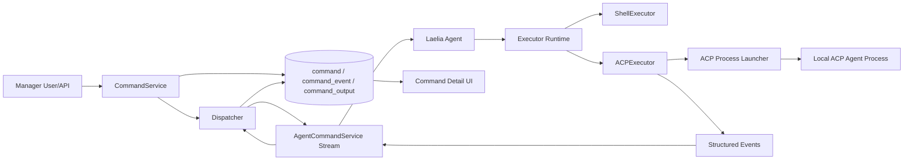
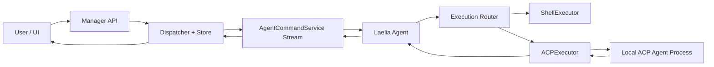

# Laelia Agent 基于 ACP 调用 LLM Agent 的详细设计方案

## 设计目标

本文档描述如何在保留现有 Laelia manager ↔ agent 控制链路的前提下，引入 [Agent Client Protocol (ACP)](https://agentclientprotocol.com/) 和 `acp-go-sdk`，使 Laelia agent 能够在目标主机上调用本机 LLM agent 执行任务，并将执行过程、工具调用、diff、最终结果等信息稳定回报到 manager。

本方案关注以下目标：

1. **可靠**：任务执行、流式过程、最终结果、取消、断线重连、事件回放都可控。
2. **安全**：manager 不直接控制高风险底层运行参数，ACP 子进程在受限环境中运行，过程数据可审计。
3. **高效**：尽量复用现有 command/dispatcher/store/UI 骨架，避免推倒重来。
4. **优雅**：shell command 与 ACP task 在同一套资源模型下共存，兼容旧 agent，支持灰度上线。

---

## 一、背景与现状分析

### 1.1 当前执行链路

当前 Laelia 的远程执行链路如下：

1. manager 通过 [proto/v1/v1/command.proto](/home/ran/gocode/laelia/proto/v1/v1/command.proto) 定义的 `CommandService.SendCommand` 创建任务。
2. manager 在 [backend/manager/api/v1/command.go](/home/ran/gocode/laelia/backend/manager/api/v1/command.go) 中落库 `command` 记录，并交由 [backend/manager/component/dispatcher/dispatcher.go](/home/ran/gocode/laelia/backend/manager/component/dispatcher/dispatcher.go) 调度。
3. agent 通过 [backend/agent/client/command_stream.go](/home/ran/gocode/laelia/backend/agent/client/command_stream.go) 建立双向流，收到 `CommandRequest` 后直接创建 `BashExecutor` 执行 shell 命令。
4. agent 把 stdout/stderr 分片作为 `CommandProgress` 回传，最终结果作为 `CommandResult` 回传。
5. manager 将输出写入 `command_output`，前端详情页通过 `WatchCommand` 订阅文本流。

### 1.2 现状优点

1. 任务调度链路已经完整，支持排队、运行中状态、取消、输出回放、结果收口。
2. manager/agent 已经有成熟的连接、鉴权、心跳、断开和恢复骨架。
3. 前端已有列表页、详情页、流式终端组件，无需另起一套任务系统。

### 1.3 现状不足

1. **执行器强绑定 shell**：agent 直接依赖 `BashExecutor`，无法优雅接入 ACP。
2. **输出模型过于扁平**：当前仅有 `STDOUT/STDERR/SYSTEM` 三类输出，不足以表达工具调用、diff、raw event 等结构化过程。
3. **manager 侧缺少 ACP 专属权限与策略控制**：当前 `SendCommand` 对执行内容和执行类型的约束较弱。
4. **恢复语义仅覆盖简单命令输出**：对多阶段 LLM agent 过程、session 恢复、事件去重支持不足。
5. **高风险参数边界未定义**：如果直接把模型、工具、二进制路径暴露给 manager，会引入过大的攻击面。

### 1.4 ACP 集成边界

本方案明确采用以下边界：

1. **首版仅支持本机 ACP agent 子进程 + stdio**。
2. **Laelia agent 作为 ACP Client，不作为 ACP Agent**。
3. **manager 继续通过现有 Laelia 协议与 agent 通信，不直接与 ACP 对接**。
4. **每个 Laelia agent 首版仍保持单任务串行执行，不引入多会话并发调度**。
5. **高风险运行参数由 agent 本地 profile 控制，manager 仅选择 profile 或默认能力**。

---

## 二、设计原则

### 2.1 保留现有 command 资源，扩展为通用 execution 容器

首版不重命名 `command` 资源，也不重构整个 manager UI 和数据模型。`command` 继续作为统一任务实例，内部通过 `executor_kind` 区分 shell 与 ACP。

这样做的理由：

1. 当前列表、详情、watch、存储、调度都围绕 `command` 建立，复用成本最低。
2. shell 与 ACP 能平滑共存，便于灰度上线。
3. 后续如果需要统一对外文案为 task/run/execution，可以在不破坏存量实现的基础上渐进演进。

### 2.2 过程真相源应当是结构化事件，而不是纯文本输出

ACP 的核心价值不只是“返回一段文本”，而是“能稳定表达执行过程”。

因此必须新增结构化事件流，将以下信息独立建模：

1. 生命周期事件
2. 文本增量
3. 工具调用开始/结束
4. diff 产出
5. warning / policy hit
6. raw ACP event 归档
7. 最终摘要 / usage / artifact

现有 `command_output` 保留，但只作为终端文本投影视图。

### 2.3 manager 控制权限，agent 控制能力边界

manager 负责：

1. 谁可以发起任务
2. 允许发什么类型的任务
3. 是否允许代码修改类任务
4. 是否允许查看 raw event
5. 任务是否超出平台策略限制

agent 负责：

1. 允许使用哪个 ACP agent 二进制
2. 允许哪些工具
3. 默认模型与系统提示词
4. 本地环境变量白名单
5. 本地最大输出、最大事件数、最大运行时长

这两层边界不能混淆。

---

## 三、总体架构

### 3.1 目标架构



### 3.2 关键抽象

1. **Command**：统一任务实例，兼容 shell 与 ACP。
2. **Executor**：agent 内统一执行器接口。
3. **CommandEvent**：结构化过程事件。
4. **Text Projection**：从结构化事件投影为文本终端输出。
5. **ACP Profile**：agent 本地能力配置。

---

## 四、协议与数据模型设计

### 4.1 `command.proto` 扩展方向

建议在 [proto/v1/v1/command.proto](/home/ran/gocode/laelia/proto/v1/v1/command.proto) 中新增以下概念。

#### 4.1.1 执行类型

```protobuf
enum ExecutorKind {
  EXECUTOR_KIND_UNSPECIFIED = 0;
  SHELL = 1;
  ACP = 2;
}
```

#### 4.1.2 任务请求扩展

在 `SendCommandRequest` / `CommandRequest` 中新增：

1. `executor_kind`
2. `instruction` 或 `task_payload`
3. `profile`
4. `allow_diff` 或同类受控布尔开关
5. `metadata`（仅允许安全的上层元数据，不允许下发底层子进程参数）

约束如下：

1. 当 `executor_kind == SHELL` 时，沿用 `command` 字段。
2. 当 `executor_kind == ACP` 时，优先使用 `instruction` / `task_payload`。
3. `profile` 只能引用 agent 已声明能力中的 profile。
4. manager 不可传入二进制路径、任意 CLI args、任意工具白名单、敏感 env。

#### 4.1.3 结果与统计扩展

建议在 `Command` 或 `CommandResult` 中增加：

1. `final_summary`
2. `result_json`
3. `artifact_refs`
4. `usage_stats`
5. `executor_kind`

这些字段主要服务于：

1. 列表页显示任务类型
2. 详情页展示最终答复和摘要
3. 后续统计 token/cost
4. 审计和排障

### 4.2 新增 `CommandEvent`

建议新增独立消息和 watch 接口，而不是复用 `CommandOutput.SYSTEM`：

```protobuf
message CommandEvent {
  string command_id = 1;
  int32 seq_no = 2;
  EventType type = 3;
  string summary = 4;
  string payload_json = 5;
  google.protobuf.Timestamp timestamp = 6;
}
```

推荐事件类型：

1. `LIFECYCLE`
2. `TEXT_DELTA`
3. `TOOL_CALL_STARTED`
4. `TOOL_CALL_FINISHED`
5. `DIFF_EMITTED`
6. `WARNING`
7. `RAW_ACP`
8. `FINAL_SUMMARY`

新增接口：

1. `WatchCommandEvents`
2. `ListCommandEvents` 或 `GetCommandEvents`

都应支持 `after_seq_no`。

### 4.3 `agent.proto` 能力面扩展

建议在 [proto/v1/v1/agent.proto](/home/ran/gocode/laelia/proto/v1/v1/agent.proto) 中引入明确 capability 结构，例如：

1. `supports_acp`
2. `default_profile`
3. `available_profiles`
4. `max_timeout_seconds`
5. `supports_diff`
6. `supports_raw_events`
7. `supports_tool_traces`
8. `max_event_count`
9. `max_output_bytes`

不建议继续把这些能力藏在 `labels` 中，因为：

1. 缺少类型约束
2. 前后端兼容困难
3. UI 不易消费
4. 容易失控扩展

### 4.4 存储模型

#### 4.4.1 `command` 表

保留现有 [backend/manager/migration/latest.sql](/home/ran/gocode/laelia/backend/manager/migration/latest.sql) 中 `command` 表主体，新增或扩展：

1. `executor_kind`
2. `instruction`
3. `profile`
4. `result_json`
5. `final_summary`
6. 可能新增 `artifact_refs_json`

如果不想改动过多字段，也可将扩展结果继续存入 `result_json`，首版优先减少 schema 扰动。

#### 4.4.2 `command_event` 表

建议新增：

```sql
CREATE TABLE command_event (
    id BIGSERIAL PRIMARY KEY,
    command_id UUID NOT NULL REFERENCES command(id) ON DELETE CASCADE,
    seq_no INTEGER NOT NULL,
    event_type SMALLINT NOT NULL,
    summary TEXT NOT NULL DEFAULT '',
    payload_json JSONB NOT NULL DEFAULT '{}',
    created_at TIMESTAMPTZ NOT NULL DEFAULT now()
);

CREATE UNIQUE INDEX idx_command_event_seq ON command_event(command_id, seq_no);
CREATE INDEX idx_command_event_created_at ON command_event(command_id, created_at);
```

设计要点：

1. 以 `(command_id, seq_no)` 做幂等写入。
2. 读取严格按 `seq_no` 排序，不依赖时间戳。
3. `payload_json` 保留结构化事件原始载荷。

#### 4.4.3 `command_output` 表

保留原有 `command_output` 表，不删除。其职责调整为：

1. shell 命令的原始 stdout/stderr 文本
2. ACP 任务的人类可读文本投影

这能保持旧 UI 和旧 watch API 兼容。

### 4.5 回放与确认位点

建议首版统一以结构化事件的 `seq_no` 作为确认位点，而不是拆分文本流与事件流双轨确认。原因是：

1. 结构化事件是 ACP 任务的过程真相源。
2. 文本输出只是事件投影。
3. 统一确认位点有利于恢复和去重。

如果未来出现文本输出与事件流完全独立的高吞吐场景，再考虑拆分 ack。

---

## 五、Agent Runtime 设计

### 5.1 执行器统一接口

建议在 agent 侧抽象统一运行时接口：

```go
type Executor interface {
    Start(ctx context.Context) error
    Cancel(ctx context.Context) error
    Events() <-chan Event
    Result() <-chan Result
    Done() <-chan struct{}
    Snapshot() (*ExecutionSnapshot, error)
}
```

设计要点：

1. `command_stream` 不再直接依赖 `BashExecutor`。
2. shell 与 ACP 统一通过事件通道回传。
3. `Snapshot` 用于本地恢复与 manager 重连恢复。

### 5.2 `ShellExecutor`

将当前 [backend/agent/executor/executor.go](/home/ran/gocode/laelia/backend/agent/executor/executor.go) 收敛为 `ShellExecutor`。

其职责：

1. 兼容当前 `bash -c` 行为
2. 将 stdout/stderr 映射为 `TEXT_DELTA` 或文本型内部事件
3. 保持现有 shell watch 行为不变

首版不建议顺手重写 shell 执行器，以降低回归风险。

### 5.3 `ACPExecutor`

`ACPExecutor` 是本次核心新增能力，负责：

1. 读取本地 profile
2. 启动 ACP agent 子进程
3. 基于 `acp-go-sdk` 建立 stdio 连接
4. 发送 `Initialize → NewSession → Prompt`
5. 将 ACP update 转换为内部事件
6. 在取消或异常时完成优雅中断与兜底回收

### 5.4 ACP 子进程启动器

建议引入单独 launcher，而不是让 `ACPExecutor` 直接拼命令。

launcher 负责：

1. 从本地 profile 选择可执行路径和固定参数
2. 设置工作目录
3. 设置 env 白名单
4. 建立 stdio pipe
5. 返回进程句柄与清理函数

安全要求：

1. 不允许 manager 传入任意可执行路径。
2. 不允许 manager 拼接任意 CLI args。
3. 不允许默认继承全部环境变量。

### 5.5 ACP 事件映射

`ACPExecutor` 需要把 ACP 语义映射到 Laelia 内部事件。建议如下：

1. ACP 文本更新 → `TEXT_DELTA`
2. ACP 工具开始 → `TOOL_CALL_STARTED`
3. ACP 工具结束 → `TOOL_CALL_FINISHED`
4. ACP diff 输出 → `DIFF_EMITTED`
5. ACP warning / policy notice → `WARNING`
6. ACP 原始 update → `RAW_ACP`
7. ACP 最终响应 → `FINAL_SUMMARY`

### 5.6 文本投影策略

需要单独定义 `TextProjection` 规则，避免详情页终端变成噪音源。

建议投影以下内容到 `command_output`：

1. 用户可读的阶段说明
2. 工具调用摘要
3. 最终答复摘要
4. 高优先级 warning

建议不直接投影：

1. 原始 ACP JSON event
2. 详细工具参数
3. 大段 diff payload

### 5.7 本地 profile 配置

首版建议在 agent 本地维护 ACP profile，例如：

```yaml
profiles:
  - name: default-acp
    command: /usr/local/bin/my-acp-agent
    args: ["--mode", "stdio"]
    defaultModel: claude-sonnet
    allowDiff: true
    allowRawEvents: true
    allowedTools: ["read_file", "apply_patch"]
    envAllowList: ["HOME", "PATH", "LANG"]
    maxTimeoutSeconds: 1800
    maxEventCount: 20000
    maxOutputBytes: 10485760
```

约束：

1. manager 只能选择 `profile name`。
2. manager 不能覆盖 `command` / `args` / `allowedTools`。
3. agent 启动时上报可用 profile 和能力摘要。

### 5.8 本地状态与恢复

扩展 [backend/agent/executor/state.go](/home/ran/gocode/laelia/backend/agent/executor/state.go) 的状态结构，新增：

1. `executor_kind`
2. `profile`
3. `last_event_seq`
4. `acp_session_id`
5. `resume_metadata`

恢复策略：

1. 如果 ACP agent 支持 `session/load`，则尝试恢复会话。
2. 如果不支持，也要恢复 manager 侧续播位点，确保重连后状态一致。
3. 如果恢复失败，应生成系统事件并将任务显式收口为失败，而不是静默丢失。

---

## 六、Manager Control Plane 设计

### 6.1 任务创建入口

在 [backend/manager/api/v1/command.go](/home/ran/gocode/laelia/backend/manager/api/v1/command.go) 中，`SendCommand` 需要扩展以下能力：

1. 解析 `executor_kind`
2. 解析 `instruction/profile`
3. 根据 agent capability 校验是否支持 ACP
4. 校验 profile 是否可用
5. 校验超时、diff 类开关是否超出策略
6. 将新增字段落库

对于 ACP 任务，必须拒绝以下输入：

1. 任意可执行路径
2. 任意 CLI args
3. 任意工具白名单
4. 任意敏感 env 注入

### 6.2 Dispatcher 扩展

在 [backend/manager/component/dispatcher/dispatcher.go](/home/ran/gocode/laelia/backend/manager/component/dispatcher/dispatcher.go) 中新增：

1. `HandleEvent`
2. `broadcastEvent`
3. 结构化事件 watcher 管理

保留现有职责边界：

1. `HandleProgress` 继续处理兼容文本输出
2. `HandleResult` 只负责最终状态收口、ack 更新、next dispatch
3. 事件落库和广播不应塞进最终结果逻辑

### 6.3 Agent 回报协议扩展

在 [backend/manager/api/v1/agent_command.go](/home/ran/gocode/laelia/backend/manager/api/v1/agent_command.go) 中，双向流消息需要扩展 event 类型承载面。

建议引入：

1. `CommandEventMessage`
2. `AgentReady` 中的 `last_event_seq`
3. 可能的 `resume_token` / `resume_hint`

### 6.4 Store 扩展

在 [backend/manager/store/command.go](/home/ran/gocode/laelia/backend/manager/store/command.go) 中新增：

1. `AppendCommandEvent`
2. `GetCommandEvents`
3. `UpdateCommandResultSummary`
4. `UpdateCommandExecutorMetadata`

要求：

1. 事件写入幂等
2. 查询严格按 `seq_no` 排序
3. 支持 `after_seq_no` 增量读取

### 6.5 鉴权与策略控制

ACP 任务必须补足独立策略控制。最低要求：

1. 谁可以对哪个 agent 发起 ACP 任务
2. 谁可以发起代码修改类任务
3. 谁可以查看 raw event
4. 是否需要审批

建议将这些规则加在 `SendCommand` 前，而不是把决定权交给 agent 本地拒绝。

### 6.6 审计与配额

应将以下维度纳入审计：

1. `executor_kind`
2. `profile`
3. 是否使用 diff
4. 工具调用摘要
5. 最终摘要

应新增以下配额：

1. 单次任务最大事件数
2. 单次任务最大文本输出
3. 单次任务最大 raw event 大小
4. 单次任务最大运行时长
5. 单 agent ACP 任务速率限制

### 6.7 取消语义

取消采用两阶段：

1. manager 发 cancel
2. agent 对 ACP 子进程先发 ACP cancel/interrupt
3. 超过宽限期后强杀本地子进程

原因：

1. 避免直接 kill 导致无最终状态或资源泄漏
2. 尽量争取 LLM agent 输出可解释的中断结果

---

## 七、安全设计

### 7.1 高风险参数不上收 manager

以下内容不得由 manager 直接控制：

1. ACP agent 可执行路径
2. ACP CLI 参数
3. 工具白名单
4. 本地敏感环境变量
5. 本地系统提示词模板全文（如需暴露，也应以 profile 名称形式暴露）

### 7.2 ACP 子进程最小权限运行

建议控制：

1. 独立工作目录
2. 最小环境变量继承
3. 显式 env allowlist
4. 超时上限
5. 输出字节上限
6. 事件数上限
7. 需要时引入 cgroup/ulimit/rootless 隔离

### 7.3 原始事件与敏感信息治理

raw ACP event 归档虽然对排障有价值，但也可能包含：

1. 大量上下文文本
2. 文件内容片段
3. 工具参数
4. 模型中间结果

因此应至少具备：

1. raw event 单独权限
2. 存储上限
3. 可选脱敏
4. UI 默认折叠

### 7.4 失败收口

以下情况都必须显式收口为系统事件和最终失败，而不是只留在 agent 日志中：

1. profile 不存在
2. 子进程启动失败
3. ACP initialize 失败
4. session 创建失败
5. event 映射失败
6. 取消超时后被强杀
7. 恢复失败

---

## 八、前端与交互设计

### 8.1 列表页

在 [frontend/src/pages/dashboard/command-list.tsx](/home/ran/gocode/laelia/frontend/src/pages/dashboard/command-list.tsx) 中：

1. 将 “Send Command” 升级为 “Send Task”
2. 增加执行类型切换：shell / ACP
3. ACP 模式下展示自然语言任务输入
4. 展示可选 profile 与受控超时
5. 不展示底层二进制路径、任意工具参数等高风险字段

### 8.2 详情页

在 [frontend/src/pages/dashboard/command-detail.tsx](/home/ran/gocode/laelia/frontend/src/pages/dashboard/command-detail.tsx) 中：

1. 保留现有 [frontend/src/components/command-terminal.tsx](/home/ran/gocode/laelia/frontend/src/components/command-terminal.tsx) 终端区域
2. 新增事件时间线面板
3. 新增 diff 视图
4. 新增工具调用摘要区
5. 新增最终结果卡片
6. raw event 折叠展示

### 8.3 数据层

在 [frontend/src/stores/command.ts](/home/ran/gocode/laelia/frontend/src/stores/command.ts) 中新增：

1. 事件订阅
2. 事件缓存
3. 基于 `seq_no` 的增量续播
4. 文本输出与结构化事件分离缓存

### 8.4 降级策略

前端需要适配以下组合：

1. 旧 shell 任务：只显示终端
2. 新 ACP 任务：显示终端 + 事件
3. manager 支持但 agent 不支持 ACP：隐藏 ACP 入口
4. 某类事件缺失：局部降级，不影响主流程显示

---

## 九、四个实施阶段

### Phase 1：契约与数据面

#### 子任务

1. 扩展 `command.proto`
2. 扩展 `agent.proto`
3. 新增 `CommandEvent` 消息和 watch 接口
4. 设计 `command_event` 存储模型
5. 定义结果摘要与统计字段
6. 完成 Go / TS 代码生成与兼容性确认

#### 实施要点

1. 所有 proto 字段只追加，不重排 tag。
2. `command` 资源保持兼容，旧 agent 继续支持 shell。
3. 结构化事件和文本输出职责必须分离。
4. 统一使用事件 seq 做回放与恢复。

#### 交付物

1. proto 更新稿
2. DB migration 草案
3. event 类型表
4. 兼容性说明

### Phase 2：Agent Runtime 与 ACP Bridge

#### 子任务

1. 抽象 `Executor`
2. 收敛 `ShellExecutor`
3. 新增 ACP launcher
4. 新增 `ACPExecutor`
5. 新增本地 profile 配置
6. 新增本地快照与恢复逻辑
7. 新增文本投影策略

#### 实施要点

1. 不重写 shell 执行语义。
2. ACP 只通过本地 profile 启动。
3. 子进程失败必须产出系统事件。
4. 取消采用 ACP cancel + kill 兜底双阶段。
5. 恢复失败必须显式收口。

#### 交付物

1. Executor 接口与运行时实现
2. ACP 子进程桥接实现
3. profile 配置样例
4. 恢复策略说明

### Phase 3：Manager Control Plane 与安全治理

#### 子任务

1. 扩展 `SendCommand` 校验与落库
2. 扩展 agent 回报协议
3. 扩展 dispatcher 的事件处理与广播
4. 扩展 store 的事件查询与写入
5. 补齐 IAM / 策略控制
6. 增加配额、审计、取消治理
7. 增加 capability gate / feature flag

#### 实施要点

1. manager 只控制权限，不控制底层进程参数。
2. 事件落库和结果收口分离。
3. 旧 agent 必须可混跑。
4. raw event 必须有单独权限控制。

#### 交付物

1. manager API 改造
2. dispatcher/store 改造
3. IAM / 审计 / 配额策略清单
4. 灰度上线策略

### Phase 4：UI 集成、兼容发布与回归验证

#### 子任务

1. 升级任务下发表单
2. 新增事件订阅与缓存
3. 升级详情页时间线 / diff / summary 展示
4. 做旧任务与缺失能力场景的降级展示
5. 设计上线顺序与回滚方案
6. 补端到端与回归测试

#### 实施要点

1. UI 优先复用现有 command 页面。
2. shell 基线流程不得退化。
3. 事件排序必须严格以 `seq_no` 为准。
4. raw event 默认折叠，不应污染主阅读路径。

#### 交付物

1. 列表页和详情页增强
2. 前端事件数据层
3. 灰度发布方案
4. 回归测试清单

---

## 十、发布顺序建议

建议按以下顺序发布：

1. **先发布 proto/store/manager 兼容层**：即使此时新 agent 尚未上线，也不应影响现有 shell 任务。
2. **再发布支持 ACP 的新 agent**：先在受控测试 agent 上验证。
3. **最后打开前端 ACP 入口和 feature flag**：仅对支持 ACP 的 agent 和授权用户开放。

这样做的好处是：

1. 回滚边界清晰
2. 不会因为 agent 未同步升级导致全量功能损坏
3. 可以逐层观察风险

---

## 十一、验证与测试策略

### 11.1 回归基线

必须确认以下现有能力不退化：

1. shell command 创建
2. shell command 执行
3. shell command 输出 watch
4. shell command 取消
5. shell command 详情页展示

### 11.2 ACP 功能测试

需要覆盖：

1. 正常执行
2. 文本流式输出
3. 工具调用轨迹
4. diff 结果展示
5. raw event 归档
6. 最终摘要与 usage 记录

### 11.3 异常与恢复测试

需要覆盖：

1. 子进程启动失败
2. ACP initialize 失败
3. 超时
4. 用户取消
5. agent 与 manager 断连
6. manager 重启
7. agent 重连
8. 事件去重与续播

### 11.4 安全测试

需要覆盖：

1. manager 不能注入任意二进制路径
2. manager 不能注入任意工具白名单
3. manager 不能注入敏感 env
4. raw event 权限隔离
5. 超量输出与超量事件受限

---

## 十二、非目标

以下内容不在首版范围内：

1. 远程 ACP HTTP/WebSocket transport
2. 一个 Laelia agent 同时跑多个 ACP 会话
3. 将 Laelia manager 改造成通用 ACP server
4. 重构全部 `command` 资源名为 `task` / `run`
5. 在首版中实现复杂审批流编排平台

---

## 十三、结论

本方案的核心不是“给现有 shell executor 再加一个分支”，而是把 Laelia 的远程执行模型升级为：

1. **统一任务资源**
2. **统一执行器运行时**
3. **结构化事件驱动过程回报**
4. **agent 本地能力控制 + manager 平台策略控制**

在这个前提下，ACP 能作为 Laelia agent 的内部执行协议稳定落地，并且不会破坏现有 shell 链路、manager 控制面和前端交互骨架。

从实施顺序上看，最关键的是先完成 **Phase 1 契约与数据面**，否则后续 agent runtime、manager store/dispatcher、UI 都会在错误抽象上反复返工。# Laelia Agent ACP 集成详细设计方案

## 设计目标

Laelia 现有的 agent 执行链路是 manager 下发 shell command，agent 在本地执行并将文本输出与最终结果回传。现在需要在不推翻现有调度骨架的前提下，引入对 ACP 的支持，使 manager 能下发面向 LLM agent 的任务，Laelia agent 通过 ACP 调用本机 LLM agent 执行，并将执行过程、工具调用、diff、最终结果等信息可靠回报给 manager。

本方案的目标是：

1. 保留现有 manager -> Laelia agent 的控制链路与鉴权模型。
2. 首版支持本机子进程 + stdio 模式的 ACP agent，不引入远程 ACP transport。
3. 保持每个 Laelia agent 单任务串行，复用现有 dispatcher 语义。
4. 让 shell 执行与 ACP 执行共存，旧路径不退化。
5. 让 manager 侧能查看可靠、结构化、可审计的执行过程，而不只是纯文本终端。
6. 将高风险运行参数固定在 agent 本地 profile，不允许 manager 直接控制底层二进制、敏感环境变量或工具白名单。

## 非目标

本次设计不包含以下范围：

1. 不将 manager 直接改造成 ACP client 或 ACP server。
2. 不支持远程 ACP agent 的 HTTP 或 WebSocket 连接。
3. 不引入一个 agent 同时执行多个 ACP 会话的并发模型。
4. 不在首版中实现完整的审批流平台或通用任务编排系统。
5. 不把模型的隐藏推理过程当作产品契约进行采集或展示；仅采集可展示的代理输出、工具调用、diff 和摘要事件。

## 现状分析

当前核心链路如下：

1. manager 通过 `CommandService.SendCommand` 创建命令记录。
2. `Dispatcher` 将待执行命令通过 `AgentCommandService.CommandChannel` 推送给 agent。
3. agent 在 `command_stream` 中收到命令后，直接实例化 `BashExecutor` 执行。
4. agent 将 stdout/stderr 以 `CommandProgress` 形式回传，将退出码和错误信息以 `CommandResult` 形式回传。
5. manager 将输出写入 `command_output` 表，并通过 `WatchCommand` 向前端广播。

这个模型对 shell command 足够，但对 ACP 存在以下不足：

1. 执行器与 shell 强耦合，当前 `command_stream` 直接依赖 `BashExecutor`。
2. 输出模型只有 `STDOUT`、`STDERR`、`SYSTEM` 三类，不足以表达工具调用、diff、结构化结果。
3. manager 侧没有 ACP 能力协商面，无法知道某个 agent 是否支持 ACP、支持哪些 profile。
4. 当前命令模型以 shell command 为中心，缺少更通用的任务元数据。
5. 当前恢复语义主要面向文本流，不足以支撑结构化事件的断线续播。
6. 当前安全边界不足以直接托管外部 LLM agent 子进程。

## 总体架构

目标架构保持三层角色不变：

1. manager 仍然是任务控制面、审计面和展示面。
2. Laelia agent 仍然是受控执行宿主，但新增 ACP client runtime。
3. 外部 LLM agent 作为本机 ACP 子进程，由 Laelia agent 受控拉起与管理。



关键原则如下：

1. manager 与 Laelia agent 之间继续使用现有 command channel，不让 ACP 细节泄漏到外部控制协议之外。
2. ACP 只存在于 Laelia agent 内部，作为一种执行器实现。
3. manager 面向的是统一的 task/command 生命周期与结构化事件流，而不是面向某个具体 ACP SDK 的内部对象模型。

## 核心设计

### 1. 任务模型与兼容策略

首版不重命名现有 `Command` 资源，继续沿用 `agents/{agent}/commands/{command}` 这一资源模型，以控制改动范围。

#### 1.1 兼容原则

1. 旧 shell 调用链路必须无需修改即可继续工作。
2. 新 ACP 任务与旧 shell 命令共用同一套 command 列表、详情页、状态机和审计主线。
3. 新字段采用追加式扩展，不重排现有 proto tag。

#### 1.2 推荐字段演进

MVP 建议继续复用现有 `command` 字段承载原始任务文本：

1. 当 `executor_kind = SHELL` 时，`command` 表示 shell command。
2. 当 `executor_kind = ACP` 时，`command` 表示自然语言任务或简短任务描述。

同时新增以下字段：

1. `executor_kind`：执行类型，首版支持 `SHELL` 与 `ACP`。
2. `profile_name`：引用 agent 本地允许的 ACP profile。
3. `result_json`：最终结构化结果摘要，复用现有数据库列。
4. 预留 `instruction` 或 `task_payload`：当后续需要 richer task schema 时再引入，不作为首版强制字段。

这样的好处是数据库迁移最小，前端列表与搜索逻辑也更容易复用。

### 2. ACP 能力声明与 profile 协商

ACP 是否可用、可用到什么程度，不应该继续依赖 `labels` 这种弱约束结构。建议在 `AgentInfo` 旁增加明确的能力摘要。

#### 2.1 Agent capability 建议项

1. `supports_acp`：是否支持 ACP 执行器。
2. `supported_profiles`：可被 manager 引用的 profile 名称集合。
3. `max_timeout_seconds`：ACP 任务允许的最大超时。
4. `supports_diff_events`：是否支持 diff 事件。
5. `supports_raw_acp_events`：是否支持保存 raw ACP event。
6. `supports_tool_trace`：是否支持工具调用结构化跟踪。
7. `max_event_count`：单任务事件数上限。
8. `max_output_bytes`：单任务文本投影上限。

#### 2.2 Profile 控制原则

profile 定义在 Laelia agent 本地，manager 只可引用 profile 名称，不可传递以下高风险参数：

1. ACP agent 可执行路径。
2. 额外启动参数。
3. 工具白名单或黑名单。
4. 敏感环境变量。
5. 模型供应商专有底层参数。

profile 由 agent 启动时加载，并通过 capability 摘要对 manager 暴露最小必要信息。

### 3. 结构化事件模型

ACP 集成后，执行过程不能继续只依赖 `CommandOutput.SYSTEM`。需要引入结构化事件流，将“展示给用户的文本”和“用于审计/回放/前端时间线的事件”分离。

#### 3.1 事件对象建议字段

1. `command_id`
2. `seq_no`
3. `event_type`
4. `timestamp`
5. `summary`
6. `payload_json`

其中：

1. `summary` 用于快速展示或日志摘要。
2. `payload_json` 保存结构化原始负载，便于前端渲染与审计追踪。

#### 3.2 首版事件类型建议

1. `LIFECYCLE`：开始、阶段切换、取消、完成。
2. `TEXT_DELTA`：用户可读文本增量。
3. `TOOL_CALL_STARTED`：工具调用开始。
4. `TOOL_CALL_FINISHED`：工具调用结束。
5. `DIFF_EMITTED`：产生代码差异或 patch。
6. `WARNING`：告警与降级信息。
7. `RAW_ACP`：原始 ACP event 归档。
8. `FINAL_SUMMARY`：最终任务摘要与关键产物。

#### 3.3 文本投影策略

不是所有结构化事件都应该进入终端文本流。必须定义一层 projection 规则：

1. `TEXT_DELTA` 通常投影到终端。
2. 工具调用只投影摘要，不投影全部参数与返回体。
3. diff 只投影简短说明，详细内容放在结构化事件里。
4. raw ACP event 不投影到终端，默认只用于审计与排障。

这样可以避免 UI 终端被噪声淹没。

### 4. 数据库存储与回放语义

#### 4.1 command 主表演进

建议在现有 `command` 表最小化扩展：

1. 新增 `executor_kind` 列，默认 `SHELL`。
2. 新增 `profile_name` 列，默认空字符串。
3. 继续复用 `result_json` 存最终结构化摘要。
4. 保留 `command` 列作为原始任务文本。

#### 4.2 command_event 新表

新增 `command_event` 表，建议包含：

1. `id BIGSERIAL PRIMARY KEY`
2. `command_id UUID NOT NULL`
3. `seq_no INTEGER NOT NULL`
4. `event_type SMALLINT NOT NULL`
5. `summary TEXT NOT NULL DEFAULT ''`
6. `payload_json JSONB NOT NULL DEFAULT '{}'`
7. `created_at TIMESTAMPTZ NOT NULL DEFAULT now()`

索引建议：

1. 唯一索引 `(command_id, seq_no)`，保证幂等写入。
2. 普通索引 `(command_id, created_at)`，便于时间线读取与排障。

#### 4.3 确认位点与恢复策略

首版建议将 `last_ack_seq` 统一解释为事件流确认位点，而不是拆成文本流确认和事件流确认两个维度。原因是：

1. 文本是事件投影，不是主事实来源。
2. 单一 seq 更易恢复与排障。
3. watcher 和前端都可以基于 `after_seq_no` 增量续播。

恢复原则：

1. event 是真相源，文本可重建。
2. manager 重连后按事件 seq 续播。
3. command 最终状态以主表为准，事件用于过程重放。

## Agent Runtime 设计

### 1. 执行器抽象

需要从当前 shell 强耦合模型中抽出统一执行器接口，建议包含：

1. `Start(ctx)`
2. `Cancel(reason)`
3. `Events() <-chan Event`
4. `Result() <-chan Result`
5. `Done() <-chan struct{}`
6. `Snapshot() *ExecutionSnapshot`

其中 `Event` 是内部统一事件对象，shell 与 ACP 都产出同一类事件，再由 `command_stream` 负责统一上报。

### 2. ShellExecutor 收敛

现有 [backend/agent/executor/executor.go](backend/agent/executor/executor.go) 保留为 shell 基线实现，但需要做如下角色调整：

1. 从 `BashExecutor` 语义转为 `ShellExecutor`。
2. 输出不再只对应 `stdout/stderr`，而是转换为统一内部事件。
3. 最终结果统一为执行器通用结果对象，供 manager 侧统一收口。

### 3. ACPExecutor 设计

ACPExecutor 是本次集成的核心新增执行器，实现职责包括：

1. 根据 `profile_name` 解析本地受控 profile。
2. 拉起本机 ACP agent 子进程。
3. 使用 `acp-go-sdk` 建立 stdio 连接。
4. 执行 `Initialize -> NewSession -> Prompt`。
5. 将 ACP update 映射为内部事件。
6. 处理取消、超时、异常退出和恢复。

### 4. ACP 子进程拉起与连接生命周期

首版仅支持 stdio。ACPExecutor 的建议时序如下：

1. 读取本地 profile。
2. 构造最小权限环境变量集。
3. 以独立工作目录拉起 ACP 子进程。
4. 通过 stdout/stdin 建立 ACP client connection。
5. 发送 `Initialize`。
6. 创建新 session。
7. 发送 prompt 执行任务。
8. 持续消费 update 并映射为内部事件。
9. 收到完成或错误后收口结果。
10. 如果被取消，先发 ACP cancel/interrupt，超时后再 kill 子进程。

### 5. ACP 配置模型

配置由 manager 集中管理，agent 不再读取本地 YAML 文件，也不再提供 `--acp-config` / `--acp-config-server` 启动参数。agent 连接时 manager 在 `ConnectAgentResponse.acp_config` 中下发结构化配置，agent 用 `BuildACPConfig` 套用内置模板生成完整的 `ACPConfig`。

用户只需配置三项（`AgentACPConfig`）：

1. `executable` — 要执行的 LLM agent，如 `npx`
2. `args` — 传给 executable 的参数，如 `["-y", "@agentclientprotocol/claude-agent-acp@latest"]`
3. `allow_env` — 子进程允许继承的环境变量名白名单，创建时预置默认列表（PATH/HOME/LANG/TERM/XDG_*/代理变量），可在配置页增删

其余字段（max_timeout/max_event_count/max_output_bytes、read/write_text_files、supports_diff/raw_events/tool_traces、auto_approve_tool_kinds）均由模板默认值填充，用户无需干预。

`working_dir` 不再由用户配置：每个 agent 在 `~/.laelia/<agent_id>/` 下拥有独立的持久工作目录，agent 启动连接时创建该目录并作为 `working_dir`，使 agent 能持久地在自己的目录中工作。`agent_id` 取自 bootstrap token 中解析出的 resource UUID。本地命令状态文件也随之移至 `~/.laelia/<agent_id>/command-state.json`，实现多 agent 同主机隔离。

未配置 executable 的 agent 处于 inert 状态：`BuildACPConfig` 返回 nil，`Capability()` 上报 `supports_acp=false`，无法运行会话，直至管理员通过 `UpdateAgentACPConfig` 设置 executable。

### 6. 会话快照与恢复

现有 [backend/agent/executor/state.go](backend/agent/executor/state.go) 需要扩展，建议保存：

1. `command_id`
2. `executor_kind`
3. `profile_name`
4. `started_at`
5. `last_event_seq`
6. `acp_session_id`
7. `resume_metadata`
8. `terminal_projection_state`

恢复分两层：

1. manager 连接恢复：能够继续向 manager 补发事件和最终状态。
2. ACP 会话恢复：如果目标 ACP agent 支持 `session/load`，则尝试恢复 session；否则退化为 manager 侧恢复，但不保证继续原地执行。

首版优先保证“状态一致、事件不乱序、不重复上报”，而不是强保证任意 ACP agent 的跨进程会话恢复。

## Manager Control Plane 设计

### 1. API 扩展

[backend/manager/api/v1/command.go](backend/manager/api/v1/command.go) 需要承担如下新职责：

1. 接收 `executor_kind`、`profile_name` 等扩展字段。
2. 根据 agent capability 校验该 agent 是否支持 ACP。
3. 根据策略检查该用户是否允许下发 ACP 任务。
4. 校验超时、profile、diff 能力等约束。
5. 以兼容方式落库，不破坏现有 shell 路径。

### 2. Stream 协议扩展

[proto/v1/v1/command.proto](proto/v1/v1/command.proto) 的 agent <-> manager stream 需要扩展：

1. `CommandRequest` 中增加 `executor_kind` 和 `profile_name`。
2. `AgentCommandMessage` 中增加 `event` 消息，用于承载结构化事件。
3. `AgentReady` 中增加最近确认的事件位点，便于恢复。

manager -> agent 仍只做任务下发与取消，不直接参与 ACP session 生命周期。

### 3. Dispatcher 扩展

[backend/manager/component/dispatcher/dispatcher.go](backend/manager/component/dispatcher/dispatcher.go) 需要新增：

1. 结构化事件落库入口。
2. 结构化事件广播入口。
3. 重连恢复时基于 `last_ack_seq` 的继续发送逻辑。
4. 兼容旧 agent 时的分支处理。

`HandleResult` 仍只负责状态收口、时长、最终摘要和 next dispatch，不承担过程事件写入。

### 4. Store 扩展

[backend/manager/store/command.go](backend/manager/store/command.go) 建议新增以下能力：

1. `AppendCommandEvent`
2. `GetCommandEvents`
3. `UpdateCommandResultSummary`
4. `WatchCommandEvents` 对应的数据读取支撑

文本输出查询接口继续保留，用于兼容旧终端视图。

### 5. Watch API 扩展

除现有 `WatchCommand` 外，建议新增：

1. `WatchCommandEvents`
2. 或 `GetCommandEvents` + 流式 watch 的组合接口

接口必须支持 `after_seq_no`，便于：

1. 页面刷新恢复。
2. 网络抖动后续播。
3. manager 或前端懒加载时间线。

## 安全设计

ACP 集成后，Laelia agent 实际上成为一个受控的本地 agent runtime 宿主。安全策略必须先于功能落地。

### 1. 运行边界

1. ACP 子进程仅允许从本地 profile 中选择。
2. 子进程运行目录需要独立，避免直接在任意路径执行。
3. 环境变量采用 allowlist 注入，不透传 manager 自定义任意 env。
4. 对敏感变量采用 denylist 二次防护。

### 2. 资源限制

建议至少加上以下限制：

1. 超时上限。
2. 文本输出上限。
3. 结构化事件数量上限。
4. 原始事件大小上限。
5. 子进程资源限制，例如 `ulimit` 或后续接入 cgroup。

### 3. 鉴权与审计

manager 侧需要增加 ACP 专属策略面，至少回答三个问题：

1. 谁可以对哪个 agent 发起 ACP 任务。
2. 谁可以发起允许代码修改或 diff 输出的任务。
3. 谁可以查看 raw ACP event。

审计上至少应保留：

1. executor_kind
2. profile_name
3. 任务摘要
4. 工具调用摘要
5. diff 摘要
6. 最终结果摘要

### 4. 隐私与展示边界

执行过程展示不应依赖模型私有推理。首版只展示以下内容：

1. 用户可读文本输出。
2. 工具调用开始/结束与摘要。
3. diff 和产物摘要。
4. 最终结果。

raw ACP event 默认不作为常规 UI 主视图内容，只作为审计和排障入口。

## 前端设计

### 1. 列表页

[frontend/src/pages/dashboard/command-list.tsx](frontend/src/pages/dashboard/command-list.tsx) 需要从“Send Command”升级到“Send Task”：

1. 支持选择 `SHELL` 或 `ACP`。
2. 当选择 `ACP` 时，展示自然语言任务输入和 profile 选择。
3. 不展示底层可执行路径、任意工具配置等高风险参数。

### 2. 详情页

[frontend/src/pages/dashboard/command-detail.tsx](frontend/src/pages/dashboard/command-detail.tsx) 建议拆成四个展示区：

1. 顶部任务摘要与状态区。
2. 终端文本区，继续复用 [frontend/src/components/command-terminal.tsx](frontend/src/components/command-terminal.tsx)。
3. 结构化事件时间线。
4. diff 与最终产物区。

raw ACP event 默认折叠，不占主视图。

### 3. Store 层

[frontend/src/stores/command.ts](frontend/src/stores/command.ts) 需要同时维护两类流：

1. 文本输出流。
2. 结构化事件流。

排序必须基于 `seq_no`，不能依赖浏览器收到事件的顺序。

### 4. 降级策略

1. 旧 shell 任务仍只显示文本终端。
2. 新 ACP 任务显示文本终端 + 事件时间线。
3. 如果 manager 或 agent 不支持某些事件类型，前端应优雅降级为摘要文本，而不是报错。

## 实施阶段与子任务

### Phase 1: 契约与数据面

1. 扩展 command.proto 的任务与 stream 协议。
2. 扩展 agent.proto 的 capability 声明。
3. 设计并新增 CommandEvent 模型。
4. 完成 command 主表和 command_event 表迁移方案。
5. 确定 `last_ack_seq` 的统一语义。
6. 完成 Go 和 TS 代码生成影响评估。

实施要点：本阶段所有工作都必须以“不破坏旧 shell agent”为前提。

### Phase 2: Agent Runtime 与 ACP Bridge

1. 抽象统一执行器接口。
2. 把当前 shell 执行收敛为 `ShellExecutor`。
3. 实现 ACP 子进程 launcher。
4. 实现 ACP client bridge。
5. 实现 profile 加载与校验。
6. 实现事件投影、快照和恢复。

实施要点：本阶段完成后，agent 应能在不改 manager 调度模型的前提下同时执行 shell 和 ACP 两类任务。

### Phase 3: Manager Control Plane 与安全治理

1. 扩展 SendCommand 与任务校验。
2. 扩展 stream message 与 dispatcher。
3. 扩展 store 和 watch 接口。
4. 增加能力协商、恢复和幂等写入逻辑。
5. 增加 ACP 专属 IAM、审计、限流与取消治理。
6. 增加 capability gate 或 feature flag。

实施要点：本阶段完成后，manager 应具备可靠、可审计、可回放的 ACP 任务控制面。

### Phase 4: UI 集成、灰度发布与回归

1. 升级任务下发表单。
2. 增加结构化事件数据层与时间线视图。
3. 增加 diff 和最终结果卡片。
4. 做 shell/ACP 双路径兼容渲染。
5. 规划发布顺序与回滚方案。
6. 完成端到端和回归验证。

实施要点：本阶段的验收标准不是“ACP 能跑起来”，而是“shell 不退化、ACP 可观察、可取消、可恢复、可审计”。

## 测试与验收标准

### 1. shell 回归

1. 创建 shell command。
2. 运行 shell command。
3. 取消 shell command。
4. watch shell 输出。

以上流程必须保持现有行为不变。

### 2. ACP 正常路径

1. 下发 ACP 任务。
2. 观察结构化事件流。
3. 观察文本投影。
4. 查看工具调用摘要。
5. 查看 diff。
6. 查看最终结果摘要。

### 3. 异常路径

1. ACP 子进程启动失败。
2. `Initialize` 失败。
3. prompt 执行超时。
4. 取消请求成功和取消超时兜底 kill。
5. manager 重启。
6. agent 断线重连。
7. 事件重复写入。
8. 事件乱序到达。

### 4. 安全路径

1. manager 无法指定未注册 profile。
2. manager 无法注入任意二进制路径。
3. manager 无法注入敏感 env。
4. 未授权用户无法下发 ACP 任务。
5. 未授权用户无法查看 raw event。

## 发布策略

建议按以下顺序灰度：

1. 先发布 proto/store/manager 兼容层，但默认关闭 ACP 入口。
2. 再发布支持 ACP 的新 agent，并上报 capability。
3. 仅对少量 agent 和授权用户打开 ACP feature flag。
4. 验证稳定后，再逐步开放到更多 agent。

回滚原则：

1. 关闭 ACP feature flag 后，旧 shell 路径必须不受影响。
2. 不强依赖新前端页面才能运行旧 shell 流程。
3. 不允许 ACP 新字段影响旧 agent 的连接与心跳。

## 建议的代码影响面

重点改造文件如下：

1. `proto/v1/v1/command.proto`
2. `proto/v1/v1/agent.proto`
3. `backend/agent/client/command_stream.go`
4. `backend/agent/executor/executor.go`
5. `backend/agent/executor/state.go`
6. `backend/agent/client/client.go`
7. `backend/manager/api/v1/command.go`
8. `backend/manager/api/v1/agent_command.go`
9. `backend/manager/component/dispatcher/dispatcher.go`
10. `backend/manager/store/command.go`
11. `backend/manager/migration/latest.sql`
12. `frontend/src/stores/command.ts`
13. `frontend/src/pages/dashboard/command-list.tsx`
14. `frontend/src/pages/dashboard/command-detail.tsx`

## 结论

本方案的核心不是“给现有 agent 再加一个执行器”这么简单，而是将 Laelia 现有的 command 执行体系扩展为一套兼容 shell、可承载 ACP 任务、具备结构化过程观测能力的统一执行框架。

如果按本设计实施，Laelia 将获得以下能力：

1. 现有 shell 执行链路保持可用。
2. ACP 任务可以被统一调度、回放、取消和审计。
3. manager 侧可以看到比纯文本终端更完整的执行过程。
4. 高风险运行参数被收束在 agent 本地 profile，安全边界更清晰。
5. 后续如果需要接更多 ACP agent 或扩展审批与策略体系，也有清晰的演进路径。