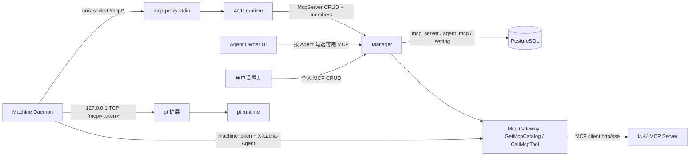

# MCP 服务管理：设计与实现

## 1. 背景与目标

管理员在 workspace 级配置中维护可用的 MCP 服务列表，并限制哪些用户/用户组可以使用
每个服务；用户在自己拥有（或可编辑）的 Agent 上勾选可用的服务；Agent 启动时把选中的
MCP 工具加载进 LLM runtime（ACP runtime 与内置 pi runtime 都支持）。在此基础上，
系统还支持**用户配置自己的个人 MCP 服务**：用户像管理员一样维护自己的服务，并且只能
在自己的 Agent 上启用。

核心取舍：**MCP 服务的传输配置与密钥只存在 manager，机器只拿按 Agent 计算的工具目录；
权限在目录下发与每次工具调用时实时校验；配置变更不需要重发机器，下次 Agent 启动/会话
生效**。

## 2. 已确认的决策

| 决策点 | 结论 |
|---|---|
| MCP 服务位置 | manager 可访问的远程服务；传输仅 http/sse（streamable HTTP 与 SSE） |
| 支持的 Agent runtime | ACP（opencode / claude-agent-acp 等）与内置 pi |
| 权限粒度 | 限制到整个 MCP 服务，不做服务内工具级 allowlist |
| 变更生效方式 | 不热更新正在运行的 Agent，下次 Agent 启动/会话生效 |
| 密钥存储 | 明文落库（与 ApiProvider 一致），读取时 mask |
| 工作区服务作用域 | workspace 全局，members 授权（users/groups/allUsers） |
| 个人服务作用域 | owner 独占：仅创建者本人可用，管理员也不能绕过 |
| 系统开关 | `allow_user_mcp_servers` 默认开启；关闭后个人服务对所有 Agent 立即失效、禁止新建/编辑，数据保留，重新开启后恢复 |
| 个人服务 URL | 暂不限制内网/私网地址 |
| 管理员视角 | 可在只读 Tab 查看所有用户的个人服务，按创建人搜索，不与工作区服务混排 |

## 3. 总体架构



- **Manager**：MCP 服务注册表（工作区 + 个人）、members 权限、Agent 选择存储、系统开关、
  工具目录计算、真实 MCP 调用网关。
- **Machine daemon**：持有机器 access token，按 Agent 身份拉取目录；对 ACP 暴露 unix
  socket 的 `/mcp/tools` `/mcp/call`，由 `laelia-machine mcp-proxy`（stdio）转发；对 pi
  在 `127.0.0.1` 起带 per-agent token 的 TCP HTTP 代理。机器上不出现服务 URL/header 密钥。
- 鉴权复用现有模式：daemon 调用 manager 时带机器 access token + `X-Laelia-Agent`
  header，manager 据此解析调用者 Agent，见
  `backend/agent/daemon/server.go:1`。

## 4. 数据模型

### 4.1 v1 proto（`proto/v1/v1/mcp.proto`）

```proto
enum McpServerScope {
  MCP_SERVER_SCOPE_UNSPECIFIED = 0;
  MCP_SERVER_SCOPE_WORKSPACE = 1;   // 工作区全局，管理员维护
  MCP_SERVER_SCOPE_USER = 2;        // 个人服务，owner 独占
}

message McpServer {
  string name = 1;                    // mcpServers/{id}
  string title = 2;
  string description = 3;
  oneof transport {                   // 4/5：http / sse
    McpHttpTransport http = 4;
    McpSseTransport sse = 5;
  }
  repeated string members = 6;        // 仅工作区服务使用
  google.protobuf.Timestamp created_at = 7;
  google.protobuf.Timestamp updated_at = 8;
  string created_by = 9;              // OUTPUT_ONLY users/{id}
  int64 config_version = 10;          // OUTPUT_ONLY，每次编辑 +1
  McpServerScope scope = 11;          // Create 时指定，之后不可变
}
```

- Header 值明文落库，读取时 mask；更新时掩码/空值表示保留原值。
- `McpServerService` RPC：`Get/List/Create/Update/Delete` + `ListMyMcpServers` +
  `ListUserMcpServers`。除 `ListUserMcpServers` 外不再用权限注解，统一 handler 内鉴权
  （工作区服务要求 `laelia.mcpServers.*`；个人服务只认 owner）。
- Agent 选择：`UpdateAgentMcpConfig` 替换 Agent 的 `mcp_servers` 资源名列表，存储侧带
  `assignment_version`；`GetAgent` 返回已启用列表。

### 4.2 系统设置（`proto/store/store/setting.proto` + `proto/v1/v1/setting.proto`）

```proto
enum SettingName { ... LLM_AGENT_CONFIG = 12; USER_MCP_CONFIG = 13; }

message UserMcpConfigSetting {
  bool allow_user_mcp_servers = 1;    // 默认 true（缺省行）
}
```

`SettingService` 新增 `GetUserMcpConfig`（handler-gated，任意登录用户可读）与
`UpdateUserMcpConfig`（admin，`laelia.settings.update`）。

### 4.3 存储（迁移 `0013##mcp-servers.sql` + `0014##user-mcp-servers.sql`）

```sql
CREATE TABLE mcp_server (
  id BIGSERIAL PRIMARY KEY,
  resource_id TEXT NOT NULL UNIQUE,
  title TEXT NOT NULL,
  description TEXT NOT NULL DEFAULT '',
  transport_type TEXT NOT NULL,          -- 'http' | 'sse'
  url TEXT NOT NULL,
  headers JSONB NOT NULL DEFAULT '{}',   -- name -> value，明文落库
  config_version BIGINT NOT NULL DEFAULT 1,
  created_by BIGINT NOT NULL DEFAULT 0,
  owner_id BIGINT NOT NULL DEFAULT 0,    -- 0014 新增：0=工作区，>0=个人服务 owner
  created_at TIMESTAMPTZ NOT NULL DEFAULT now(),
  updated_at TIMESTAMPTZ NOT NULL DEFAULT now()
);
CREATE UNIQUE INDEX idx_mcp_server_resource_id ON mcp_server(resource_id);
CREATE INDEX idx_mcp_server_owner_id ON mcp_server(owner_id);

CREATE TABLE mcp_server_member (
  server_id BIGINT NOT NULL REFERENCES mcp_server(id) ON DELETE CASCADE,
  member TEXT NOT NULL,
  PRIMARY KEY (server_id, member)
);

CREATE TABLE agent_mcp (
  agent_id BIGINT NOT NULL REFERENCES agent(id) ON DELETE CASCADE,
  mcp_server_id BIGINT NOT NULL REFERENCES mcp_server(id) ON DELETE RESTRICT,
  assignment_version BIGINT NOT NULL DEFAULT 1,
  created_at TIMESTAMPTZ NOT NULL DEFAULT now(),
  PRIMARY KEY (agent_id, mcp_server_id)
);
```

个人服务不写 `mcp_server_member`（members 强制为空），`agent_mcp` 对两类服务通用。
删除服务前检查是否有 Agent 引用，有则 `FailedPrecondition`。

## 5. 权限与作用域

### 5.1 工作区服务（owner_id = 0）

- 管理员：`laelia.mcpServers.create/get/update/delete` 管理；`list` 可见全部。
- 普通用户：只能看到自己是 members 的服务（`users/{uid}` / `groups/{...}` /
  `allUsers`），并在自己的 Agent 上启用。

### 5.2 个人服务（owner_id = 创建者）

- 仅创建者本人可读、可改（开关开启时）、可删（开关关闭时仍可删，用于清理）。
- **owner 独占**：管理员的 `laelia.mcpServers.*` 权限不能绕过；个人服务不出现在管理员
  的工作区列表里。
- Agent 侧判定以 **agent owner**（无 owner 时回退 created_by）为准：仅当 agent owner
  与 server owner 相同且系统开关开启时才可用。
- 管理员可以在「我的服务」Tab 创建自己的个人服务（管理员同时也是普通用户）。

### 5.3 权限矩阵

| 操作 | 工作区服务 | 个人服务 |
|---|---|---|
| Create | admin（`scope=WORKSPACE`） | 任意登录用户（开关开启，`scope=USER`） |
| Get/List | admin 全部；member 可用 | owner 仅自己；admin 通过 `ListUserMcpServers` 只读查看全部 |
| Update | admin | owner 且开关开启 |
| Delete | admin | owner（开关关闭时也允许） |
| Agent 启用/调用 | agent owner 为 member 或 admin | agent owner == server owner 且开关开启 |

## 6. Manager 网关

`McpGatewayService`（unary，注册进
`backend/manager/server/grpc_routes.go`），
鉴权走现有 IAM/CUSTOM 链 + `X-Laelia-Agent` 解析。

```proto
service McpGatewayService {
  rpc GetMcpCatalog(GetMcpCatalogRequest) returns (GetMcpCatalogResponse);
  rpc CallMcpTool(CallMcpToolRequest) returns (CallMcpToolResponse);
}

message McpTool {
  string mcp_server_id = 1;
  string server_name = 2;         // 服务展示名
  string tool_name = 3;
  string runtime_name = 4;        // 注入 runtime 的名字（碰撞前缀）
  string title = 5;
  string description = 6;
  google.protobuf.Struct input_schema = 7;
  int64 config_version = 8;
  int64 assignment_version = 9;
  string server_description = 10; // 服务描述，展示给 agent
}
```

### 6.1 GetMcpCatalog

1. 由 `X-Laelia-Agent` 解析 Agent，加载 `agent_mcp` 选择。
2. 逐服务按 **agent owner** 实时校验权限（工作区：member/admin；个人：owner 且开关
   开启），失败/开关关闭的服务跳过。
3. 用 MCP client 拉取工具列表（进程内缓存 5 分钟，key=server id+config version），
   生成目录。
4. 每个工具生成 `runtime_name`：`r<sha256(server_id)[:8]>_<tool_name>`，保证多服务
   同名工具不碰撞；同时带 `server_name/server_description` 供 agent 展示服务归属。

### 6.2 CallMcpTool

1. 重新解析 Agent，校验服务已分配且当前权限有效。
2. 校验 `expected_config_version / expected_assignment_version`，不一致返回
   `mcp_stale_catalog`（fail closed）。
3. 校验 `tool_name` 属于该服务当前工具列表（allowlist）。
4. 调真实 MCP 服务，把结果规范化为 text/image content block。
5. 限制：单次调用超时 25s、响应 ≤ 512KB；**当前未限制 URL 目标地址**（决策 2）。

### 6.3 MCP client 组件

`backend/manager/component/mcp/` 手写最小 JSON-RPC over HTTP/SSE 客户端：

- streamable HTTP：POST 到配置 URL，`initialize` → `notifications/initialized` →
  `tools/list` → `tools/call`，支持 `Mcp-Session-Id`。
- SSE：GET `/sse` 等 endpoint 事件，POST `/messages?session_id=...`，响应可直接在
  POST body 或事件流中返回。
- 统一 25s 超时、512KB 响应上限。

## 7. 机器侧注入

### 7.1 daemon 本地代理

`backend/agent/daemon/server.go:219`：

- **pi 路径**：`McpProxyURLForAgent` 在 `127.0.0.1:<随机端口>` 起 TCP HTTP 代理，URL
  形如 `http://127.0.0.1:<port>/mcp/<per-agent token>`；`GET /mcp/{token}/tools`、
  `POST /mcp/{token}/call`。
- **ACP 路径**：unix socket 上的 `GET /mcp/tools`、`POST /mcp/call`，请求体带 agent
  资源名；由 `laelia-machine mcp-proxy` 转发。

### 7.2 ACP runtime

- `backend/agent/client/runner.go:329`
  `buildMcpServers` 每 turn 通过 daemon 拉目录，非空时注入一个 stdio MCP server：
  `laelia-machine mcp-proxy`，env 带 `LAELIA_DAEMON_SOCKET` / `LAELIA_SESSION_TOKEN` /
  `LAELIA_AGENT` / PATH。
- `mcp-proxy` 是 MCP stdio server：`tools/list` 把目录转成 MCP 工具列表（description
  带服务名/描述），`tools/call` 转发 unix socket → manager 网关。
- ACP 每 turn 是新子进程，目录天然按启动时刷新。

### 7.3 pi runtime

pi 核心不内置 MCP；laelia 在 Agent 工作目录生成扩展
`<workingDir>/.pi/extensions/laelia-managed-mcp.ts`（pi 自动发现），通过
`LAELIA_MCP_PROXY_URL` 指向 daemon TCP 代理：

1. 扩展 factory **必须是 async**：pi 会 await factory 完成后再开始 session，因此
   fetch 目录 + `pi.registerTool()` 都在有效 ctx 内完成（避免
   “extension ctx is stale after session replacement”）。
2. 每个工具注册为 pi 原生工具，label/description/promptSnippet 带
   `服务名 - 服务描述`，让 agent 能看到服务归属。
3. 工具 `execute` POST `/call`，带 `mcpServerId/toolName/arguments/
   expectedConfigVersion/expectedAssignmentVersion`，daemon 转发网关。
4. 扩展在 pi 会话启动时写入（
   `backend/agent/pi/session.go:158`），
   选择变化后下次启动生效。

### 7.4 线格式约定（重要）

daemon 是机器侧唯一出口，统一输出 **MCP wire JSON**（
`backend/agent/daemon/server.go:322`）：

- 目录：`configVersion/assignmentVersion` 用**数字**（不能用 protojson 的字符串
  int64），否则 pi 扩展回传版本号时 daemon 解码失败返回 400。
- 调用结果：content block 显式带 `type`，如
  `{"type":"text","text":"..."}` / `{"type":"image","data":...,"mimeType":...}`，
  而不是 protojson 的 `{"text":{"text":"..."}}` 嵌套。
- 这两个格式问题曾分别导致「工具调用 HTTP 400」和「工具结果为空」，已修复并加了
  回归断言。

### 7.5 版本与刷新

- 每次 runtime 启动实时拉取目录，不使用跨启动缓存。
- 调用带版本号，manager 侧变化返回 `mcp_stale_catalog`；ACP 下一 turn 自然刷新，
  pi 下次重启刷新。

## 8. 配置下发与生效

- MCP 选择不随 `AgentAssignment` 下发；daemon 用 Agent 身份实时向网关拉目录。
- `UpdateAgentMcpConfig` 成功后写 `agent_mcp`、bump `assignment_version`，并
  best-effort 推送 `ReloadAgentAssignment`（pi 侧下次 turn/启动重新加载）。
- 管理员改服务配置/成员、用户改个人服务后无需推送，下次启动/会话按新目录生效。

## 9. 系统开关与个人 MCP

### 9.1 开关

- 位置：设置 → Agents / LLM（`settings-agents.tsx`），Switch 调
  `UpdateUserMcpConfig`；默认开启。
- 读取：个人 MCP 设置页与 Agent 配置页调 `GetUserMcpConfig`（任意登录用户可读）。

### 9.2 行为

- 开启：任意用户可在「我的服务」创建个人服务（http/sse、headers、mask 规则与管理员
  一致，无 members），并可在自己的 Agent 上启用。
- 关闭：个人服务从所有 Agent 目录与调用中立即消失（fail closed）；禁止新建/编辑；
  **允许删除**（清理数据）；数据保留，重新开启后恢复。

### 9.3 管理端只读视图

- 「用户服务」Tab 只读展示所有用户的个人服务（`ListUserMcpServers`，
  `laelia.mcpServers.list`），列：名称/类型/URL/创建人；支持**按创建人搜索**
  （匹配邮箱或用户资源名）。

## 10. 前端

### 10.1 MCP 设置页（单页 + Tabs）

`frontend/src/pages/dashboard/settings-mcp-servers.tsx`：

- **工作区服务**（仅管理员）：现有 CRUD + members 列。
- **我的服务**（所有登录用户，含管理员）：个人服务 CRUD，无 members；开关关闭时
  显示停用提示，新建/编辑禁用、删除保留。
- **用户服务**（仅管理员，只读）：全部用户的个人服务 + 创建人搜索。
- 侧边栏「MCP 服务」入口对所有登录用户可见。

### 10.2 Agent 配置

`frontend/src/pages/dashboard/agent-profile.tsx`
的 MCP 区块按「工作区 MCP 服务 / 我的 MCP 服务」分组勾选；数据来自
`ListMcpServers` + `ListMyMcpServers` 的合并（store 层，开关关闭时自动跳过个人服务），
保存仍是一次 `UpdateAgentMcpConfig`。

## 11. 实现状态与验证

已完成并验证：

- Admin CRUD + members + mask；Agent 启用；网关目录/调用 + 版本校验 + 缓存。
- ACP stdio `mcp-proxy` 与 pi 扩展两条注入路径；真实 pi 0.82.1 端到端验证工具注册
  与调用。
- 服务名/描述透出到 agent 工具定义。
- 个人 MCP：迁移、owner 权限、系统开关、管理端只读 + 创建人搜索、前端 Tabs 与
  Agent 分组。
- `go build ./backend/...`、golangci-lint、后端相关测试、前端 biome/lint/type-check/
  测试均通过。

## 12. 风险与后续

- **SSRF 面扩大**：个人服务 URL 暂不限制内网/私网地址，等于把 manager 的出网能力开放
  给普通用户；后续可对个人服务增加回环/私网/云元数据地址校验。
- 网关是单点：MCP 调用经过 manager，需监控超时与错误；后续如需直连可加 per-server
  routing 开关。