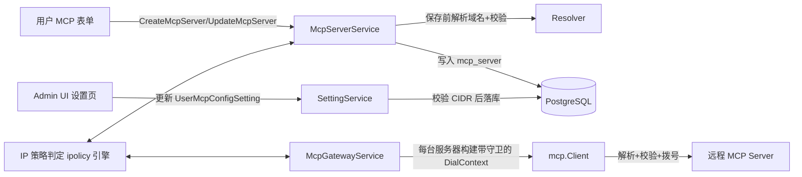

# MCP 目标 IP 策略（SSRF 防护）设计

> 状态：2026-09-06 已对照当前代码核对更新。主要变化：本设计已全部实现——判定引擎
> `component/mcp/ipolicy.go`、保存路径校验 `api/v1/mcp_ip_policy.go`、连接守卫
> `component/mcp/client.go`（按服务器缓存的守卫 client + 请求层预检，覆盖 HTTP 代理
> 与重定向）、设置读写并入统一 `GetSetting`/`UpdateSetting`、前端弹窗与策略卡片均已落地。

## 1. 背景与目标

`allow_user_mcp_servers` 开启后，任意用户可以在自己的 Agent 上配置个人 MCP 服务
（`scope=USER`，`owner_id != 0`）。MCP 网关运行在 manager 进程内
（`component/mcp.Client`），直接对用户填写的 URL 发起 HTTP/SSE 请求
（`backend/manager/component/mcp/client.go` 的 `httpClient.Do` / `sseClient.Do`），
本设计实施前**没有任何 SSRF 防护**：
用户把 URL 指向 `http://169.254.169.254/`（云元数据）或内网地址，manager 就会代其发起
请求。个人 MCP 与管理员维护的全局 MCP 共用同一条连接通道，风险面一致。

本设计解决两件事：

1. 管理员开启「允许用户配置个人 MCP」时，做**二次确认**，明确提示 SSRF 风险
   （可打内网/云元数据）。
2. 提供 **MCP 目标 IP 黑白名单策略**：管理员可配置「仅允许」与「仅禁止」的 IP 段
   （CIDR，IPv4/IPv6 均支持），两者**可同时配置、黑名单优先**；用户配置域名时按需
   解析域名拿 IP 做校验；策略可**全局生效**或**仅对用户创建的个人 MCP 生效**；
   **默认关闭**，由管理员显式开启。

> 本设计取代 `docs/plan/mcp-service-management-design.md` 中「个人服务 URL 暂不限制
> 内网/私网地址」的旧决策。

## 2. 已确认的决策

| 决策点 | 结论 |
|---|---|
| 黑白名单语义 | 白名单、黑名单**同时可配**，命中黑名单即拒绝（黑名单优先）；白名单为空表示「不限制允许段」，非空时目标 IP 必须命中其一 |
| 默认策略 | **关闭**（`enabled=false`），不改变现有行为；由管理员显式开启 |
| 「只对用户创建的生效」 | = 仅作用于**个人 scope 服务器**（`owner_id != 0`，含管理员创建的个人服务器）；「全局」= 作用于所有 MCP 服务器（含管理员维护的全局服务器） |
| 域名校验时机 | **双层**：保存时解析+校验（即时反馈）；连接时经自定义 `DialContext` 强制复检（防 DNS rebinding，对存量服务器自动生效） |
| 校验失败语义 | 连接路径 **fail-closed**：解析失败或任一解析 IP 违规即拒绝 |
| 二次确认 | 仅「开启」开关时弹确认框；关闭不弹 |
| 兼容性 | 不新增 setting 行、不迁移数据库；扩展 `UserMcpConfigSetting` JSON 字段，旧数据零值=关闭 |

## 3. 威胁模型

- 攻击者：任意可登录用户（含攻击者自注册的普通账号）。
- 能力：`allow_user_mcp_servers` 开启时创建个人 MCP 服务器，URL 指向任意 http(s)
  地址。
- 后果：manager 作为跳板访问：
  - 云元数据服务（AWS/GCP/Azure `169.254.169.254`、阿里云 `100.100.100.200`、
    腾讯云 `169.254.0.23` 等）；
  - 内网服务（`10/8`、`172.16/12`、`192.168/16`、`100.64/10` CGNAT 等）；
  - manager 自身服务（`127.0.0.1:8181`）。
- 可窃取：内网接口数据、云凭据（IMDSv1 场景）、manager 本机可达的管理面信息。
- 本设计通过「管理员显式开启策略 + 保存时校验 + 连接时强制」三层降低该风险。

## 4. 总体设计



- **策略数据**：挂在 `UserMcpConfigSetting.mcp_ip_policy`（复用 `USER_MCP_CONFIG`
  setting 行，JSON 存储，无需迁移）。
- **保存路径**：`CreateMcpServer` / `UpdateMcpServer` 按策略作用域做域名解析与 IP
  校验，违规直接拒绝（即时反馈）。
- **连接路径**：`mcp.Client` 增加可注入的 IP 策略守卫，`DialContext` 内
  解析→校验→拨号被允许的 IP；TLS SNI 与 Host 头仍用原域名（Go `http.Transport`
  以请求 URL 为准，与拨号地址无关）。
- **判定引擎**：已落地为纯函数包 `backend/manager/component/mcp/ipolicy.go`（单测
  `backend/manager/component/mcp/ipolicy_test.go`）；保存路径校验在
  `backend/manager/api/v1/mcp_ip_policy.go`。

## 5. 数据模型

### 5.1 store proto（`proto/store/store/setting.proto`）

```proto
message UserMcpConfigSetting {
  // allow_user_mcp_servers gates personal MCP servers（现有字段，不变）
  bool allow_user_mcp_servers = 1;

  // mcp_ip_policy 控制 MCP 目标地址的 IP 黑白名单。零值 = 关闭，兼容旧数据。
  McpIpPolicy mcp_ip_policy = 2;
}

message McpIpPolicy {
  // enabled 为 false 时不执行任何限制（默认关闭，Q2=A）。
  bool enabled = 1;

  enum Scope {
    SCOPE_UNSPECIFIED = 0; // 视作 SCOPE_USER_CREATED（保守默认）
    // 作用于所有 MCP 服务器，含管理员维护的全局服务器。
    SCOPE_ALL = 1;
    // 仅作用于个人 scope 服务器（owner_id != 0，即用户创建的个人 MCP）。
    SCOPE_USER_CREATED = 2;
  }
  Scope scope = 2;

  // 白名单：非空时目标 IP 必须命中其一；为空表示不限制允许段。
  repeated string allow_cidrs = 3;

  // 黑名单：命中即拒绝，优先级高于白名单。
  repeated string deny_cidrs = 4;
}
```

### 5.2 v1 proto（`proto/v1/v1/setting.proto`）

无需新增 RPC：统一资源式 `SettingValue.user_mcp_config`（`GetSetting` /
`UpdateSetting`）直接透传扩展后的 `laelia.store.UserMcpConfigSetting`。

### 5.3 判定语义（唯一事实来源）

```
输入: ip（已 netip.Addr.Unmap() 归一化）, policy
enabled == false                       -> ALLOW
ip ∈ deny_cidrs（任一前缀）            -> DENY（黑名单优先）
allow_cidrs 非空 && ip ∉ allow_cidrs   -> DENY
其余                                   -> ALLOW
```

作用域判定：`SCOPE_ALL` 恒生效；`SCOPE_USER_CREATED` 仅当 `server.OwnerID != 0`
生效。v1 proto 中 `McpServerScope_USER` 与 `OwnerID != 0` 等价。

## 6. 后端实现

### 6.1 IP 策略引擎（`backend/manager/component/mcp/ipolicy.go`，已实现）

- `ParsePolicy(p *storepb.McpIpPolicy) (*CompiledPolicy, error)`：解析 CIDR 为
  `[]netip.Prefix`（`netip.ParsePrefix` + `Masked()` 归一化去重），非法条目报错
  （错误信息带具体条目）；allow/deny 合计超过 `maxIPPolicyCIDRs = 500` 条报错。
- `CompiledPolicy.Allowed(addr netip.Addr) (*IPPolicyDenyReason, error)`：实现 5.3
  判定，拒绝时返回 `IPPolicyDenyReason`（携带命中前缀或「不在白名单」标记，其
  `Error()` 即面向用户的拒绝原因文案）；IPv4-mapped IPv6（`::ffff:10.0.0.1`）先
  `addr.Unmap()` 再匹配。
- `CompiledPolicy.HasAllowRestriction()`：白名单非空即视为有允许侧限制，用于解析
  失败时的 fail-closed 判定。
- `CompiledPolicy.AppliesTo(ownerID int64) bool`：作用域判定（`SCOPE_ALL` 恒生效，
  其余仅 `ownerID != 0` 生效）。

### 6.2 设置接口（`backend/manager/api/v1/setting_service.go`，已实现）

设置读写走统一的资源式 `SettingService.GetSetting` / `UpdateSetting`（资源名
`settings/user_mcp_config`；独立的 `GetUserMcpConfig`/`UpdateUserMcpConfig` RPC
并未采用）：

- `UpdateSetting` 按 update_mask 路径（`value.user_mcp_config.allow_user_mcp_servers`
  / `value.user_mcp_config.mcp_ip_policy`）把请求 payload 合并进存量配置
  （`updateUserMcpConfig`），合并后对最终 `McpIpPolicy` 做 `ParsePolicy` 校验，
  非法 CIDR 返回 `CodeInvalidArgument`（错误信息带具体条目）。
- `enabled=true` 且两张表都为空时允许保存（视为放行一切），前端显示「策略已启用
  但未配置任何网段」警示。
- `GetSetting` 原样返回（CIDR 非敏感）。

### 6.3 保存路径校验（`backend/manager/api/v1/mcp_ip_policy.go`，已实现）

`validateMcpServerTarget(ctx, settings, serverURL, isPersonal bool) error`，由
`backend/manager/api/v1/mcp_server_service.go` 在 `buildMcpTransportForCreate` /
`buildMcpTransportForUpdate` 之后、落库之前对 Create/Update 调用：

- 读取 `UserMcpConfigSetting`（store 层 30s TTL 缓存，见 6.5）；`!enabled` 或策略作用域
  不覆盖该服务器 → 直接放行。
- host 为 IP 字面量 → 直接按该 IP 判定。
- host 为域名 → 经 `mcpTargetResolver` 接口（生产用 `net.DefaultResolver`，单测注入
  fake）`LookupNetIP(ctx, "ip", host)` 取全部地址，解析带 `mcpTargetLookupTimeout = 5s`
  超时；**任一地址违规即拒绝（fail-closed）**，错误形如：
  - 命中黑名单：`InvalidArgument: MCP target <host> resolves to <ip> which is denied by MCP IP policy prefix <prefix>`
  - 白名单非空且未命中：`... resolves to <ip> which is not in the MCP IP policy allow list`
- 解析失败：
  - 白名单非空 → 拒绝（`cannot resolve MCP target ... against the workspace MCP IP
    policy allow list`，无法验证，fail-closed）；
  - 仅黑名单（白名单为空）→ 允许保存（连接时必然失败，错误更自然）。
- 作用域：`isPersonal = (新服务器 scope==USER) || (存量服务器 OwnerID != 0)`。

> 解析发生在 manager 网络上下文，与实际连接同源，结果有代表性。

### 6.4 连接路径强制（`backend/manager/component/mcp/client.go` + `mcp_gateway_service.go`，已实现）

`mcp.Client` 注入点：

```go
type IPPolicyFunc func(ctx context.Context, server *store.McpServerMessage, ip netip.Addr) (bool, error)
func (c *Client) SetIPPolicy(fn IPPolicyFunc)
```

- `McpGatewayService.NewMcpGatewayService` 注入闭包 `checkTargetIP`：读策略 → 编译
  （`compiledIPPolicy`，30s 缓存）→ `CompiledPolicy.AppliesTo(server.OwnerID)` →
  `Allowed(ip)`。
- **按服务器缓存的守卫 client**（实现与原设计不同，非每次调用新建）：策略启用时
  `httpClientFor` / `sseClientFor` 为每台服务器克隆一次 Transport（保留
  `Timeout: 25s` 与 `Proxy` 字段）并安装守卫 `DialContext`，按
  ResourceID+URL+OwnerID 缓存（上限 128），连接与 TLS 会话可跨 RPC 复用；策略未启用
  时直接用共享 client。
- **请求层预检**：每个请求发送前 `checkTarget` → `resolveTargetHosts` 解析目标 host
  的全部地址并逐 IP 过策略，返回按解析序排列的批准地址列表；无批准地址即连接失败
  （fail-closed）。批准结果缓存 `targetCacheTTL = 30s`，key 按 server+host 隔离，
  两台服务器共享同一域名不会互串校验结果。
- **守卫拨号**：`guardedDial` 对已验证目标直接拨批准的 IP:port（`dialAny` 按序逐个
  尝试，保留多地址原生 fallback、被拒地址跳过）；缓存外的拨号地址——典型为配置的
  HTTP 代理——按原样拨号，因为目标本身已在请求层校验。**代理场景因此也被覆盖**
  （原设计只覆盖直连的边界已消除）。
- TLS SNI / Host 头由 transport 依据请求 URL 的 host 设置，不受拨号 IP 影响，
  证书校验行为不变。
- **重定向**：`CheckRedirect` 对每个跳转目标复检策略（上限 10 跳），跨 host 跳转
  不可绕过。
- **SSE endpoint**：`base.ResolveReference(endpoint)` 同源推导；初始 GET 与
  messages POST 前均 `checkTarget`（含解析出的 messages endpoint）。
- 被拒地址记录 `slog.Warn("mcp target blocked by IP policy", server, host, ip)`。

### 6.5 设置读取缓存（已实现）

`backend/manager/store/user_mcp_setting.go` 的 `GetUserMcpConfigSetting` 带
`userMcpConfigCacheTTL = 30s` 进程内缓存，`UpsertUserMcpConfigSetting` 写入后立即
刷新缓存，避免每次 MCP 工具调用多一次 DB 读。网关侧另有一个 30s 的编译策略缓存
（`mcp_gateway_service.go` 的 `ipPolicyCacheTTL`）。安全影响：策略变更最多延迟 30s
生效，可接受。

## 7. 前端实现

### 7.1 二次确认弹窗（`frontend/src/pages/dashboard/settings-agents.tsx`）

- `handleUserMcpToggle(next)`：`next == true` 时先置 `showMcpEnableConfirm=true`
  并返回，不调 API；弹 `AlertDialog`（复用 `@/components/ui/alert-dialog`，参考
  `user-list.tsx` 用法）：
  - 标题：`settings.agents.allow-user-mcp-confirm-title`
    「确认允许用户配置个人 MCP 服务？」
  - 描述：`settings.agents.allow-user-mcp-confirm-description`
    「开启后，用户填写的 MCP 服务地址将由服务器代为连接，存在 SSRF 风险：可被
    用于访问内网服务或云元数据（如 169.254.169.254）。建议同时配置下方
    MCP 目标 IP 策略。」
  - 「确认开启」→ 调 `updateUserMcpConfig` 并更新状态；「取消」→ 开关保持关闭。
- `next == false` 直接执行，不弹窗。

### 7.2 IP 策略配置 UI（同页，`canUpdate` 权限可见）

开关下方新增卡片「MCP 目标 IP 策略」：

- 启用开关（`policy.enabled`）；
- 作用域：单选「全局生效 / 仅对用户创建的个人 MCP 生效」（默认后者）；
- 白名单 textarea（每行一个 CIDR，留空=不限制允许段）＋ 黑名单 textarea；
- 黑名单下方「添加内网/云元数据预设」按钮，幂等追加：
  `0.0.0.0/8`、`10.0.0.0/8`、`100.64.0.0/10`、`127.0.0.0/8`、
  `169.254.0.0/16`、`172.16.0.0/12`、`192.168.0.0/16`、`198.18.0.0/15`、
  `224.0.0.0/4`、`240.0.0.0/4`、`::1/128`、`fc00::/7`、`fe80::/10`；
- 保存按钮 → `updateUserMcpConfig`（携带 `allowUserMcpServers` 现值与完整
  `mcpIpPolicy`）；客户端仅按行拆分（trim/去空行），CIDR 合法性由服务端最终裁决，
  错误经 `showErrorToast` 展示；
- 启用但两表皆空时显示警示文案。

### 7.3 用户侧 MCP 表单（`settings-mcp-servers.tsx`，已实现）

- 创建/编辑被策略拒绝时，服务端错误信息直接展示（`showErrorToast` 通道）；
- 表单 URL 输入下方在策略启用时显示提示「工作区已启用 MCP 目标 IP 策略，域名将做
  解析校验」（页面读取 `GetSetting("settings/user_mcp_config")` 的
  `mcpIpPolicy.enabled`，以 `ipPolicyActive` 传入表单，键
  `settings.mcp-servers.ip-policy-active-hint`）。

### 7.4 i18n

`frontend/src/locales/en-US.json` / `zh-CN.json` 新增 `settings.agents.*` 键：
确认弹窗 2 条、策略卡片标题/提示/作用域/白名单/黑名单/预设/保存/警示各 1 条。

## 8. 测试计划

| 层 | 用例 |
|---|---|
| ipolicy 引擎单测 | 黑名单优先；白名单为空=放行；白名单非空限制；IPv6（`::1/128`）；IPv4-mapped 归一化；非法 CIDR 报错；列表上限；作用域判定（`OwnerID==0` / `!=0`） |
| 保存路径单测 | 注入 fake resolver：命中黑名单拒、白名单未命中拒、多 A 记录任一违规拒（fail-closed）、解析失败+白名单非空拒、解析失败+仅黑名单放行、策略关闭放行、作用域不覆盖放行 |
| 连接守卫测试 | `httptest` 起 127.0.0.1 服务：黑名单含 `127.0.0.0/8` → `ListTools` 失败且错误含策略信息；白名单含之 → 成功；域名解析到被拒 IP → 失败 |
| 设置接口测试 | 非法 CIDR → `InvalidArgument`；合法策略往返一致；零值 = 关闭；旧 JSON 行（无 `mcp_ip_policy`）读取后等价关闭 |
| 前端 | `pnpm --dir frontend type-check`、`biome:check`、`test` |

以上均已落地，对应测试：引擎单测
`backend/manager/component/mcp/ipolicy_test.go`（黑名单优先、白名单空/非空、IPv6 与
IPv4-mapped、非法 CIDR、去重与上限、作用域）；连接守卫
`backend/manager/component/mcp/client_ip_policy_test.go`（loopback 拦截、白名单放行、
域名解析到被拒 IP、SSE、代理地址不误拦、重定向复检、多地址 fallback、缓存行为）；
保存路径 `backend/manager/api/v1/mcp_ip_policy_test.go`（黑名单拒、白名单未命中拒、
多 A 记录 fail-closed、IP 字面量、解析失败±白名单、策略关闭放行、作用域覆盖）；
设置接口见 `backend/manager/api/v1/setting_service_test.go` 与
`backend/manager/api/v1/mcp_server_service_test.go`。

## 9. 兼容性与迁移

- **无数据库迁移**：`USER_MCP_CONFIG` 行为 JSON，新字段缺失时 proto3 零值
  （`enabled=false`）= 关闭，存量环境行为不变。
- proto 变更流程：`buf format -w proto` → `buf lint proto` → `cd proto && buf generate`
  → `gofmt -w` 生成文件。
- 前后端混版：新后端 + 旧前端——旧前端不传策略字段，保持关闭；新前端 + 旧后端——
  未知字段被忽略，策略 UI 保存无效但无副作用（可接受，随版本收敛）。
- 存量个人 MCP 服务器：保存时未校验，但连接守卫自动生效；管理员开启策略后无需
  逐台处理。

## 10. 安全边界与注意事项

- **fail-closed**：连接路径解析失败或任一解析 IP 违规即拒绝，防 DNS rebinding
  （解析与拨号同一上下文、直接拨 IP，中间无第二次解析窗口）。
- **黑名单优先**：即使白名单放行，命中黑名单仍拒绝。
- **多 A 记录**：任一地址违规即整体拒绝（避免连接落在违规地址上）。
- **归一化**：IPv4-mapped IPv6 先 `Unmap()`；CIDR 统一 `Masked()` 规范形。
- **重定向/SSE**：同守卫 Transport 覆盖，跨 host 跳转不可绕过。
- **代理边界**：配置 HTTP 代理时，请求层预检已在发送前校验目标地址（守卫拨号只对
  已验证目标生效，代理地址按原样拨号），直连与代理场景均被覆盖（见 6.4）。
- **限流/审计**：保存路径解析带 `mcpTargetLookupTimeout = 5s` 超时；连接路径被拒事件
  `slog.Warn` 记录 host/ip（`client.go`），后续可挂审计（audit 框架已存在，见
  `recordMcpServerChange`）。
- **范围外**：MCP header 泄密（Authorization 头随请求发出）不在本次范围；LLM
  base URL、S3 endpoint、webhook 等其它用户可控出站地址可复用同一引擎，列为后续
  增强。

## 11. 实施步骤（已全部完成）

1. **P1 数据与引擎**：store proto 扩展（`UserMcpConfigSetting.mcp_ip_policy`）+
   `buf generate`；`component/mcp/ipolicy.go` 引擎 + 单测；`setting_service.go`
   合并路径 + CIDR 校验。
2. **P2 保存路径**：`api/v1/mcp_ip_policy.go` 保存前域名解析校验（resolver 抽象为
   `mcpTargetResolver` 接口便于注入）+ 单测。
3. **P3 连接路径**：`mcp.Client` 守卫拨号 + 请求层预检 + gateway 注入 +
   单测/集成测试。
4. **P4 前端**：二次确认弹窗 + 策略编辑卡片 + i18n；`settings-mcp-servers.tsx`
   提示文案。
5. **P5 收尾**：按 AGENTS.md 跑 `gofmt`/`golangci-lint`/`go test`/前端
   `type-check`+`biome:check`+`test`，构建 `build/laelia`，回归验证开启→配置→
   创建被拒→连接被拒全链路。

## 12. 后续可选增强

- 管理员「策略影响面」视图：开启/保存策略时 dry-run 扫描现有服务器，列出将
  被拦截的服务器（保存路径 + 连接守卫可复用判定引擎）。
- 被拦截事件写入审计日志（audit buffer 已存在）。
- 同一 IP 策略引擎扩展到 LLM provider base URL、S3 endpoint 等出站地址。
- 个人 MCP 表单 URL 输入即时校验（浏览器侧仅能做格式校验，域名解析仍以服务端
  为准）。
